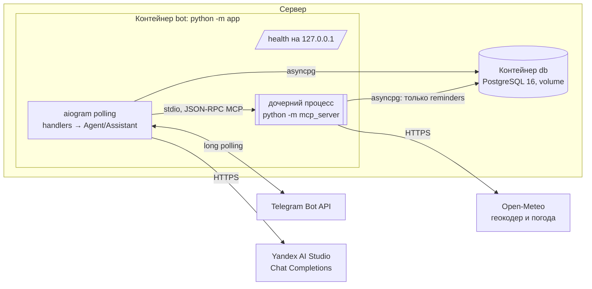
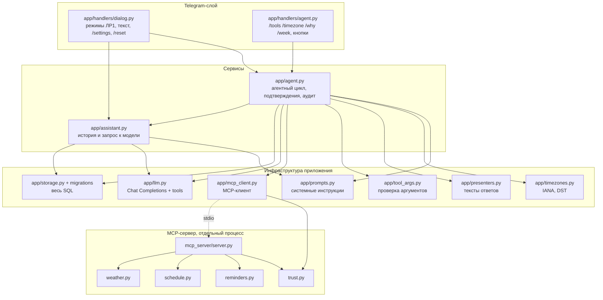
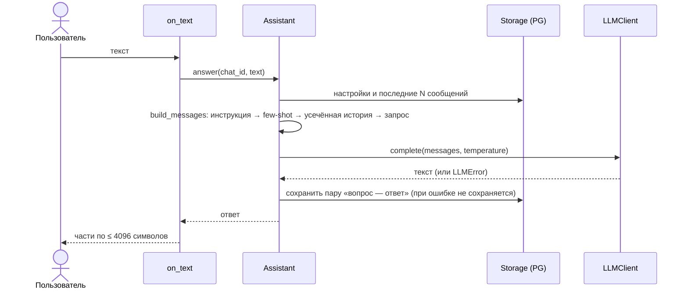
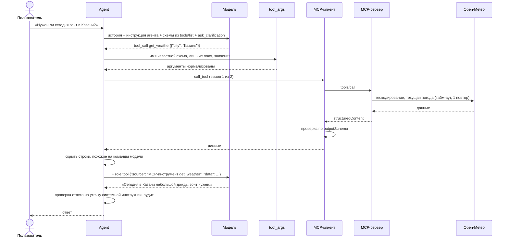
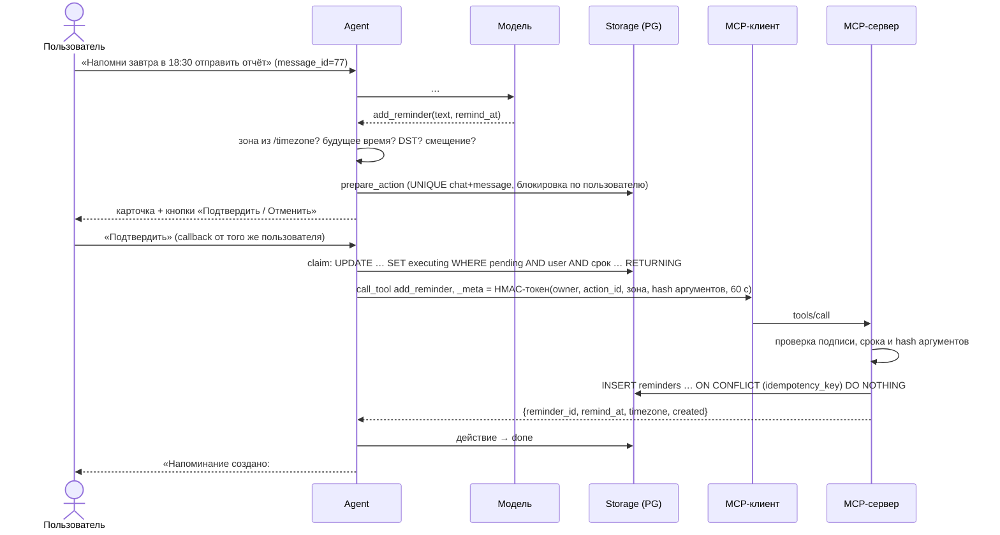
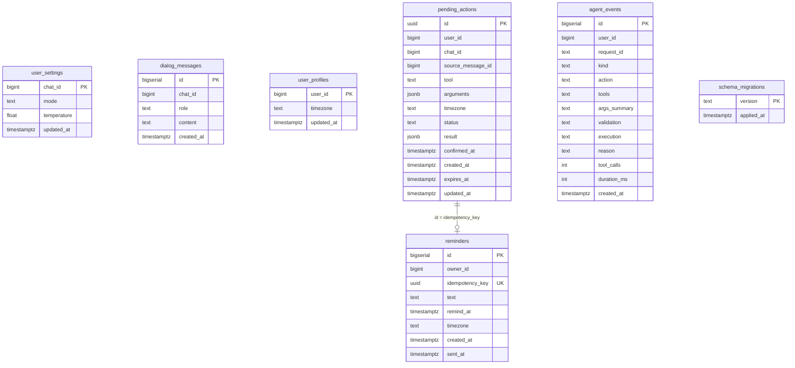
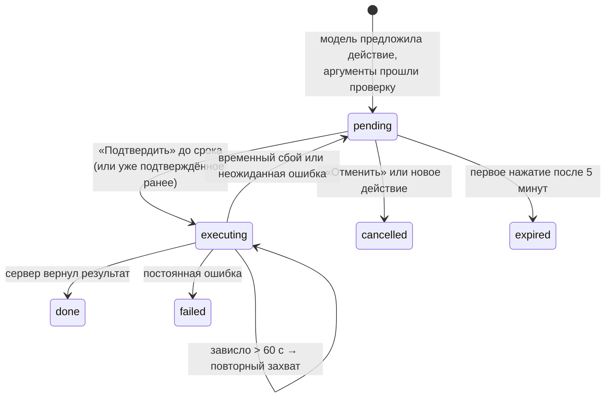

# Архитектура

Как устроен бот «AI-ассистент студента»: из каких процессов он состоит, как проходит
каждое сообщение, где хранятся данные и какие механизмы защищают от ошибок модели.
Требования и наблюдаемое поведение — в [spec.md](spec.md), схемы инструментов — в
[mcp-contracts.md](mcp-contracts.md), настройки — в [configuration.md](configuration.md).

## 1. Обзор

Telegram-бот отвечает с помощью большой языковой модели (YandexGPT через
OpenAI-совместимый API) и работает в двух ролях:

| Роль | Режимы | Что умеет | Лабораторная |
|---|---|---|---|
| Ассистент | `/study`, `/translate`, `/quiz` | отвечает в заданном стиле, помнит историю диалога | № 1 |
| Агент | `/agent` (по умолчанию) | сам выбирает: ответить, уточнить или вызвать инструмент MCP-сервера (погода, расписание, напоминания) | № 2 |

Ключевой принцип: **модель предлагает, приложение проверяет и выполняет**. Модель не
получает доступа к базе, файлам или сети. Она возвращает текст или структурированный вызов
функции, а код решает, допустим ли он.

## 2. Процессы и развёртывание



- **Входящих портов нет.** Бот сам опрашивает Telegram (long polling), служебный
  `/health` слушает только `127.0.0.1`.
- **MCP-сервер не отдельный сервис.** Бот запускает его дочерним процессом и общается через
  stdin/stdout. Снаружи сервер недоступен, а при падении бот перезапускает его сам.
- **База** — отдельный контейнер с именованным volume: данные переживают пересборку и
  деплой.
- **Варианты сети.** По умолчанию бот ходит в БД по имени сервиса `db`. На сервере в РФ бот
  работает в сети хоста (`compose.hostnet.yaml`), а БД опубликована только на `127.0.0.1`
  (см. [operations.md](operations.md#5-сеть-на-сервере-в-рф)).

## 3. Слои и зависимости



Правила границ (подробнее — [AGENTS.md](../AGENTS.md)):

- обработчики не содержат SQL, схем инструментов и логики выбора;
- весь SQL приложения находится в `app/storage.py`, только с параметрами `$1`, `$2`;
- `mcp_server/` не импортирует `app/`; общий код только один — `mcp_server/trust.py`
  (подпись доверенного контекста);
- схемы инструментов приходят от сервера через MCP-обнаружение и в боте не дублируются.

## 4. Жизненный цикл приложения

Запуск (`app/__main__.py::run`):

1. Чтение и проверка настроек (`Settings.load`). Ошибка конфигурации завершает процесс
   понятным сообщением без секретов.
2. Пул PostgreSQL (`create_pool`, проверка `SELECT 1`).
3. Проверка токена: `getMe` и `getWebhookInfo` (тайм-аут 30 с). При установленном webhook
   запуск отменяется — polling и webhook несовместимы.
4. Миграции БД (`Storage.init_schema` → `apply_migrations`).
5. HTTP-сессия и клиент модели (`LLMClient`).
6. MCP: генерируется секрет доверенного контекста, запускается дочерний процесс и
   выполняется первая попытка подключения (до 15 с). Если сервер не поднялся, бот работает
   без инструментов и переподключается в фоне.
7. Агент, меню команд Telegram, диспетчер с роутерами (сначала агентский, потом общий),
   `/health`, polling.

Остановка (`finally`): отмена polling, остановка `/health`, закрытие MCP (дочерний процесс
завершается), HTTP-сессий и пула БД (до 10 с, затем `terminate`).

## 5. Путь сообщения

### 5.1. Режимы ЛР № 1



### 5.2. Агент: вопрос, для которого нужен инструмент чтения



### 5.3. Агент: напоминание и подтверждение



### 5.4. Команды агента

| Команда | Откуда данные | Обработчик |
|---|---|---|
| `/tools` | последний список `tools/list` и `resources/list` MCP-клиента | `on_tools` → `presenters.tools_text` |
| `/timezone [зона]` | `user_profiles`, проверка по списку зон пакета `tzdata` | `on_timezone` → `Agent.set_timezone` |
| `/why` | последнее событие `agent_events` пользователя | `on_why` → `presenters.why_text` |
| `/week` | ресурс `schedule://current-week` | `on_week` → `Agent.current_week` |

## 6. Агентный цикл

```text
reply(request):
  режим не /agent → Assistant.answer (ЛР1, без инструментов)
  messages = [инструкция агента с датой, календарём, зоной и состоянием инструментов]
             + усечённая история + запрос
  for раунд in 1..3:                                  # 2 вызова MCP + итоговый ответ
      ответ = модель(messages, tools = схемы MCP + ask_clarification)
      нет tool_calls      → проверка на утечку инструкции → ответ
      ask_clarification   → проверка на утечку → вопрос пользователю
      неизвестное имя     → отказ «Такого действия у меня нет»
      аргументы не прошли → объяснение, что не так
      инструмент с эффектом:
          были данные с «командами» → отказ
          иначе → подготовить действие и показать карточку
      уже 2 вызова MCP    → остановка «Достигнут лимит», limit_exceeded
      вызов MCP; ошибка   → честное сообщение с кодом, без «успешно»
      скрыть строки-команды в данных; неоднозначный город → список вариантов
      добавить assistant(tool_call) + tool(result) и продолжить
  при сбое модели после успешного чтения → ответ, собранный из данных без модели
  finally: событие аудита (действие, инструменты, аргументы, проверка, выполнение, мс)
```

| Решение модели | Что делает приложение | Действие в аудите |
|---|---|---|
| текст | отправляет (после проверки на утечку) | `respond` |
| `ask_clarification` | задаёт вопрос | `clarify` |
| инструмент чтения | вызывает через MCP, отдаёт результат модели | `call_tool` |
| инструмент с эффектом | готовит действие, ждёт кнопку | `prepare_action` |
| неизвестный инструмент или плохие аргументы | отказывает с объяснением | `rejected` |
| третий вызов подряд | останавливается | `limit_exceeded` |
| сбой модели или MCP | честная ошибка | `error` |

Почему так:

- **Схемы берутся из обнаружения**, поэтому новый инструмент сервера появится у модели без
  правок бота.
- **`ask_clarification`** — служебная функция приложения. Благодаря ей «уточнение»
  машинно отличимо от обычного ответа, и это можно проверить в эксперименте.
- **Календарь на 7 дней** в контексте: без него модель в понедельник превращала «в пятницу»
  в дату среды.
- **`temperature` агента 0.2** (`AGENT_TEMPERATURE`): выбор инструмента должен быть
  воспроизводимым.

## 7. MCP-подсистема

### 7.1. Сервер (`mcp_server/`)

| Модуль | Ответственность |
|---|---|
| `server.py` | `build_server(deps)`: регистрация `get_weather`, `get_schedule`, `add_reminder` и ресурса `schedule://current-week`. `StrictMCPServer` отклоняет аргументы вне схемы (SDK по умолчанию молча их отбрасывает), всем входным схемам ставится `additionalProperties: false` |
| `weather.py` | `OpenMeteoWeather`: геокодирование → выбор города (только `PPL*`, точное название, уточнение после запятой, автоматический выбор при перевесе населения ×10, иначе `ambiguous`) → текущая погода. `HttpJsonFetcher`: тайм-аут, 1 повтор при тайм-ауте, сетевой ошибке или 5xx |
| `schedule.py` | Формат файла (Pydantic, `extra=forbid`): зона, семестр, цикл недель, исключения. `lessons_on`, `day`, `week`; строгий разбор даты и диапазон ±400 дней |
| `reminders.py` | `PgReminderStore`: пул создаётся при первом вызове (под `asyncio.Lock`); `insert_reminder` — `ON CONFLICT (idempotency_key) DO NOTHING`, при повторе возвращается прежняя запись |
| `trust.py` | `sign` / `verify` доверенного контекста |
| `errors.py` | `ToolFailure(code, message)` — единый формат ошибки (JSON в текстовом блоке) |
| `__main__.py` | Чтение окружения, ленивые зависимости, `lifespan` закрывает HTTP-сессию и пул, логи только в stderr (stdout занят протоколом), фильтр секретов |

Зависимости сервера внедряются через `ServerDeps` (погода, источник расписания,
хранилище, секрет, часы). В тестах подставляются фейки и подменяемые часы.

### 7.2. Клиент (`app/mcp_client.py`)

- **Супервизор** — отдельная задача asyncio, которая владеет соединением. Она подключается
  (тайм-аут 20 с), выполняет `tools/list` и `resources/list` и ждёт сигнала «соединение
  сломано», затем переподключается с паузой 1 → 2 → 4 … 60 с.
- **Последний известный список инструментов** сохраняется после разрыва. Если модель
  попросит инструмент, пользователь получит честное «сейчас недоступны».
- **`call_tool`** работает так:
  1. проверяет, что клиент подключён и инструмент известен;
  2. вызывает инструмент с тайм-аутом `MCP_CALL_TIMEOUT_SECONDS`;
  3. при ошибке сервера разбирает её JSON;
  4. проверяет `structuredContent` по `outputSchema` (jsonschema).

Классификация ошибок:

| Что случилось | Код | Переподключение |
|---|---|---|
| процесс сервера умер (`MCPError CONNECTION_CLOSED`), закрыт поток, `OSError` | `mcp_unavailable` | да |
| тайм-аут вызова | `timeout` | нет |
| сервер вернул ошибку инструмента | код сервера (`city_not_found`, `weather_timeout`, `untrusted_context`, …) | нет |
| SDK отклонил результат по `outputSchema` или результат не прошёл нашу проверку | `bad_result` | нет |
| инструмента нет в списке | `unknown_tool` | нет |

Коды `mcp_unavailable`, `timeout` и `storage_unavailable` считаются временными: после них
действие можно подтвердить ещё раз.

### 7.3. Доверенный контекст

```text
token = base64url(JSON{v, owner_id, action_id, timezone, args: sha256(канонический JSON аргументов), exp}) + "." + hex(HMAC-SHA256(secret, base64url-часть))
_meta["ru.itmo.tgbot/trusted-context"] = token
```

Сервер проверяет: подпись (`hmac.compare_digest`), версию, тип `owner_id`, срок `exp` и то,
что hash аргументов совпадает с полученными аргументами. Значит, нельзя:

- создать напоминание без бота — нет секрета;
- подменить владельца — `owner_id` подписан, а поле `owner_id` в аргументах отклоняется
  как лишнее;
- подтвердить одно действие, а выполнить другое — подписан hash аргументов;
- переиграть старый токен — срок 60 с, а ключ идемпотентности тот же `action_id`.

## 8. Данные



| Таблица | Кто пишет | Ограничения и хранение |
|---|---|---|
| `user_settings` | бот | одна строка на чат |
| `dialog_messages` | бот | остаются последние `HISTORY_MAX_MESSAGES` сообщений чата |
| `user_profiles` | бот (`/timezone`) | IANA-имя, проверенное приложением |
| `pending_actions` | бот | `UNIQUE (chat_id, source_message_id)`; `status IN (pending, executing, done, cancelled, expired, failed)`; индекс `(user_id, status)` |
| `reminders` | MCP-сервер | `idempotency_key UNIQUE`; длина текста 1–500 (`CHECK`); `sent_at` — для ЛР № 3 |
| `agent_events` | бот | последние 50 событий на пользователя, без текстов сообщений |
| `schema_migrations` | раннер миграций | применённые версии |

Миграции — файлы `app/migrations/NNN_*.sql`. При старте бот берёт advisory-блокировку и в
одной транзакции применяет недостающие версии по порядку. База ЛР № 1, созданная без
`schema_migrations`, обновляется без потери данных (`001` использует `IF NOT EXISTS`).

## 9. Подтверждение: состояния и гарантии



| Ситуация | Механизм | Результат |
|---|---|---|
| Telegram повторно доставил тот же update | `UNIQUE (chat_id, source_message_id)` | то же действие, та же карточка |
| Два нажатия «Подтвердить» одновременно | атомарный `UPDATE … WHERE status='pending' … RETURNING` | выполняет одно, второе — «уже выполняется» или «уже создано» |
| Ответ сервера потерялся, нажали ещё раз | `ON CONFLICT (idempotency_key)` | та же запись, `created: false` |
| Два сообщения пользователя параллельно | `pg_advisory_xact_lock` по пользователю | действующая карточка одна — последняя |
| Бот упал между захватом и завершением | `executing` старше 60 с захватывается снова | повтор безопасен благодаря идемпотентности |
| Нажал чужой пользователь | все запросы с `user_id` и `chat_id` из нажатия | «Действие не найдено» |

Всё это проверено интеграционными тестами на настоящем PostgreSQL.

## 10. Время и часовые пояса

- Список зон и правила берутся из пакета `tzdata`. `zoneinfo.reset_tzpath([])` выключает
  системную базу, поэтому результат одинаков в Linux, macOS и Windows.
- `/timezone` принимает только имена из списка `tzdata` (без учёта регистра) и сохраняет
  каноническое имя.
- `localize` отклоняет локальное время, которое на переходе часов не существует или
  встречается дважды.
- Для напоминания: смещение обязательно, время толкуется в зоне пользователя. Допустимо
  текущее смещение или смещение на дату напоминания, само время должно быть в будущем и не
  дальше года.
- Без `/timezone` даты «сегодня/завтра» считаются по `DEFAULT_TIMEZONE`, а напоминания не
  готовятся.

## 11. Безопасность

| Угроза | Защита | Где |
|---|---|---|
| Утечка токенов и ключей | только `.env` вне Git; `SecretFilter` в журнале; `.dockerignore` | `app/logging_setup.py`, `mcp_server/__main__.py` |
| Персональные данные в логах | в журнале только `request_id`, имена инструментов, коды, длительности; Telegram ID и тексты не пишутся | `app/agent.py`, `app/handlers` |
| Модель подменяет владельца | владелец только из update; подписанный `_meta`; лишние поля отклоняются | `trust.py`, `StrictMCPServer` |
| Модель зовёт несуществующий инструмент | сверка с обнаруженным списком; имя в аудит не пишется | `Agent._run` |
| Инъекция через данные инструментов | строки-команды скрываются; действие с эффектом в этом сообщении блокируется; результат помечен как данные | `tool_args.neutralize` |
| Раскрытие системной инструкции | ответ с её фрагментом (≥ 30 символов) заменяется отказом | `agent._guard_leak` |
| Бесконечный цикл и расходы | ≤ 2 MCP-вызовов и ≤ 3 обращений к модели на сообщение | `Agent._run` |
| Действие без согласия | только через карточку и кнопку того же пользователя, срок 5 минут | `prepare_action` / `claim_action` |
| Произвольные файлы и SQL | путь к расписанию только из конфигурации; модель не видит SQL и реквизиты БД | `SCHEDULE_PATH`, `storage.py` |
| Доступ к сервисам снаружи | нет входящих портов; MCP по stdio; БД и `/health` только на `127.0.0.1` | `compose*.yaml` |

## 12. Тайм-ауты и повторы

| Граница | Тайм-аут | Повторы |
|---|---|---|
| Модель (`LLM_TIMEOUT_SECONDS`) | 60 с | нет; после успешного чтения — ответ из данных |
| Telegram `getMe` при старте | 30 с | нет (процесс перезапустит Docker) |
| Open-Meteo, один запрос | `WEATHER_TIMEOUT_SECONDS` = 5 с | 1 повтор (тайм-аут, сеть, 5xx), пауза 0,3 с |
| MCP-вызов | `MCP_CALL_TIMEOUT_SECONDS` = 30 с | нет; временная ошибка → действие можно подтвердить снова |
| Подключение к MCP | 20 с | бесконечно, пауза 1 → 60 с |
| PostgreSQL | подключение 5 с, команда 5 с | пул asyncpg |

## 13. Справочник модулей

| Файл | Что внутри |
|---|---|
| `app/__main__.py` | запуск и остановка, сборка зависимостей |
| `app/config.py` | `Settings.load` — единственное место чтения и проверки переменных |
| `app/db.py` | пул asyncpg с проверкой `SELECT 1` |
| `app/storage.py` | миграции и весь SQL: настройки, история, зона, действия, аудит |
| `app/llm.py` | `LLMClient.complete` (ЛР1) и `.chat` (с `tools`), разбор `tool_calls`, ошибки `LLMError` |
| `app/assistant.py` | `build_messages`, `trim_history`, `Assistant` — режимы ЛР1 |
| `app/agent.py` | `Agent.reply` / `confirm` / `cancel`, системная инструкция агента, аудит, `_guard_leak` |
| `app/tool_args.py` | `validate_arguments`, `summarize`, `neutralize` |
| `app/mcp_client.py` | `McpGateway`, `ToolSpec`, `ToolCallError`, окружение дочернего процесса |
| `app/presenters.py` | тексты погоды, расписания, недели, `/tools`, карточки, `/why` |
| `app/timezones.py` | `normalize_timezone`, `localize`, `format_local` |
| `app/prompts.py` | режимы и их инструкции (R.C.T.F., few-shot), шаблон инструкции агента |
| `app/handlers/dialog.py` | `/start`, режимы, `/settings`, `/reset`, текст, разбиение > 4096 |
| `app/handlers/agent.py` | `/tools`, `/timezone`, `/why`, `/week`, кнопки `ActionCallback` |
| `app/health.py`, `app/healthcheck.py` | `/health` и проверка для Docker |
| `app/logging_setup.py` | фильтр секретов в журнале |
| `mcp_server/*` | см. раздел 7.1 |
| `data/schedule.json` | обезличенное расписание |
