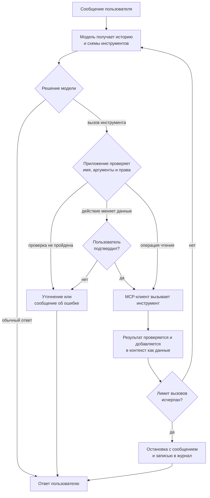

# Разработка AI-ассистента в Telegram

Методические указания к выполнению лабораторных работ по дисциплине
«Технологии искусственного интеллекта в разработке программного обеспечения».

## Аннотация

В рамках трёх лабораторных работ разрабатывается один сквозной проект —
AI-ассистент на базе Telegram-бота. На первом этапе бот получает возможность
вести диалог с помощью языковой модели, на втором — обращаться к внешним данным
и выполнять действия через MCP-инструменты, на третьем — распределять запросы
между специализированными компонентами и отправлять проактивные уведомления.

## Содержание

1. [Введение](#usage)
2. [Общая подготовка](#preparation)
3. [Основные понятия](#concepts)
4. [Лабораторная работа № 1](#lab1)
5. [Лабораторная работа № 2](#lab2)
6. [Лабораторная работа № 3](#lab3)
7. [Приложения](#appendices)

<a id="usage"></a>

## Введение

Все лабораторные работы выполняются в одном репозитории и последовательно
расширяют возможности одного приложения:

1. В лабораторной работе № 1 Telegram-бот подключается к языковой модели,
   получает режимы общения и сохраняет контекст диалога.
2. В лабораторной работе № 2 бот становится агентом: выбирает и вызывает
   инструменты собственного MCP-сервера.
3. В лабораторной работе № 3 обработка запросов разделяется между
   специализированными компонентами, а приложение получает проактивные
   сценарии и средства трассировки.

Каждая следующая работа опирается на работоспособный результат предыдущей.
Перед началом нового этапа необходимо сохранить завершённое состояние проекта
в Git. Исправления архитектуры и кода из предыдущих работ допускаются, если они
не нарушают уже выполненные требования и сопровождаются тестами.

### Обозначения обязательных и дополнительных требований

В тексте используются три уровня требований:

- **Требуется** — обязательная часть работы, которая входит в критерии приёмки.
- **Рекомендуется** — способ повысить надёжность или качество решения. Можно
  выбрать другой способ и объяснить свой выбор в отчёте.
- **Дополнительно** — необязательное расширение, которое выполняется после всех
  обязательных требований.

Если конкретная библиотека или структура файла не обозначена как обязательная,
студент может выбрать собственное техническое решение. Оно должно быть
совместимо со стартовым проектом, воспроизводиться по инструкции и не снижать
безопасность приложения.

Критерии приёмки описывают полное выполнение работы на максимальный балл, а не
являются отдельным допуском к оцениванию. Каждая строка таблицы оценивания
проверяется независимо:

- максимальный балл выставляется, когда все перечисленные в строке результаты
  воспроизводятся и подтверждены требуемыми тестами или экспериментом;
- часть баллов выставляется пропорционально числу выполненных проверяемых элементов;
- ноль баллов выставляется, если результат отсутствует, не запускается по инструкции
  или его существование подтверждается только текстом отчёта;
- нарушение безопасности не обнуляет несвязанные части работы, но не позволяет
  получить баллы за затронутый критерий до устранения нарушения.

### Правила использования AI-инструментов при разработке

Разрешается использовать AI-ассистенты для анализа документации, проектирования,
генерации заготовок, поиска ошибок и подготовки тестов. Цель работ
состоит не в механическом написании кода без помощи инструментов, а в умении
ставить им задачи, проверять результат и принимать обоснованные инженерные
решения.

При работе с AI-инструментами требуется:

- самостоятельно проверить и протестировать предложенный код;
- понимать назначение добавленных компонентов и уметь объяснить их работу;
- не передавать токены, пароли, персональные данные и полные файлы окружения;
- проверять актуальность названий библиотек, методов и параметров по официальной
  документации;
- фиксировать в отчёте, какие AI-инструменты применялись и для каких задач;
- описать хотя бы один случай, когда предложение AI-инструмента было отклонено
  или исправлено, и объяснить причину.

Ответ AI-ассистента не является подтверждением корректности решения. Таким
подтверждением служат работающая программа, результаты тестов, проведённый
эксперимент и аргументация студента.


<a id="preparation"></a>

## Общая подготовка

### Требования к компьютеру и программному обеспечению

Для выполнения работ необходимы:

- компьютер с Windows, macOS или Linux;
- Python 3.12;
- Docker Desktop либо Docker Engine с Docker Compose v2;
- Git;
- среда разработки или редактор с поддержкой Python;
- учётная запись Telegram;
- доступ к интернету для работы Telegram, загрузки зависимостей и обращения к внешней
  языковой модели;
- доступ к OpenAI-совместимому API языковой модели либо к согласованной локальной
  модели.

Инструкции по установке и команды проверки приведены в [README](../README.md).
Для выполнения лабораторных не требуется заранее устанавливать PostgreSQL:
локальная база данных запускается в Docker.

### Получение стартового репозитория

Создайте собственный репозиторий на основе выданного шаблона и клонируйте его на
компьютер. Если шаблон получен в виде архива, распакуйте его, инициализируйте Git
и привяжите репозиторий, в который будет сдаваться работа.

Путь к проекту может содержать пробелы и символы кириллицы. Не размещайте проект
в каталоге, доступном другим пользователям компьютера: локальные файлы окружения
будут содержать секреты.

Перед первым изменением проверьте состояние рабочей копии:

```bash
git status
```

В рабочей копии не должно быть случайно добавленных файлов `.env`, `.venv`,
`.deploy`, дампов базы данных и журналов с чувствительными данными.

### Структура проекта

Стартовый проект содержит минимального echo-бота и инфраструктуру, общую для
всех трёх лабораторных:

```text
app/                 код Telegram-бота
  handlers/          обработчики сообщений и команд
scripts/             локальный запуск и облачное развёртывание
tests/               автоматические тесты
docs/                документация проекта
compose.local.yaml   локальный PostgreSQL
compose.yaml         контейнеры для развёртывания
pyproject.toml       настройки Python-инструментов
requirements.txt     зависимости приложения
.env.example         пример конфигурации без секретов
```

Echo-обработчик является временным поведением стартового проекта. Обработчики
команд лабораторных следует подключать перед общим обработчиком текста, иначе
echo-обработчик перехватит сообщение первым.

Инфраструктурный код можно изменять, когда этого требует решение, но изменение
должно сохранять локальный запуск, корректное завершение приложения и служебную
проверку состояния.

### Первый локальный запуск

Создайте Telegram-бота и запустите проект по инструкции
[«Создать бота и запустить проект»](../README.md#2-создать-бота-и-запустить-проект)
в README. После запуска отправьте боту текстовое сообщение. Стартовая версия
должна вернуть тот же текст.

### Настройка переменных окружения

Локальные настройки хранятся в `.env`. Состав
доступных переменных и правила записи специальных символов описаны в
[README](../README.md#4-настройки-env-и-envcloud).

В ходе лабораторных потребуется дополнить конфигурацию параметрами выбранного
LLM-провайдера. Для каждого нового параметра требуется:

1. Добавить безопасное вымышленное значение или пустой пример в `.env.example`.
2. Считать и проверить значение в модуле конфигурации приложения.
3. Не включать действительное значение в код, тесты, отчёт и снимки экрана.
4. Выдавать понятную ошибку при отсутствии обязательного значения.

Названия новых переменных должны однозначно отражать назначение. Например,
ключ доступа и адрес API являются разными настройками и не должны храниться в
одной строке.

### Подключение PostgreSQL

PostgreSQL уже подключён к приложению через пул `asyncpg`. Стартовая версия
проверяет соединение запросом `SELECT 1`, но не создаёт учебных таблиц.

Данные диалогов, пользовательские настройки, напоминания и события обработки,
которые должны сохраняться после перезапуска, следует размещать в PostgreSQL.
Схема данных развивается по мере выполнения лабораторных.

При работе с базой данных требуется:

- передавать пользовательские значения параметрами SQL-запроса;
- не создавать новый пул соединений для каждого сообщения;
- учитывать раздельные данные разных пользователей;
- предусматривать повторный запуск приложения;
- не удалять существующие данные как способ исправить обычную ошибку схемы;
- не включать пароли и содержимое пользовательских диалогов в диагностические
  сообщения.

Таблицы можно создавать миграциями либо другим воспроизводимым способом. Выбор
должен быть описан в `README.md` проекта.

### Работа с Git и фиксация этапов

Git используется для сохранения проверяемых состояний проекта и истории
инженерных решений. Рекомендуется делать небольшой коммит после завершения
каждого независимого требования и успешного запуска связанных тестов.

Перед началом лабораторной убедитесь, что результат предыдущей работы сохранён.
Сдаваемое состояние обозначьте тегом:

```bash
git tag -a lab1 -m "Лабораторная работа № 1"
git tag -a lab2 -m "Лабораторная работа № 2"
git tag -a lab3 -m "Лабораторная работа № 3"
```

Номер тега должен соответствовать завершённой лабораторной. Если после сдачи
потребовалось исправление, используйте новый согласованный тег, а не
переназначайте опубликованный тег без объяснения.

Сообщения коммитов должны кратко описывать результат изменения.

### Запуск тестов и статических проверок

Перед началом работы подготовьте окружение, не запуская второй экземпляр бота,
по разделу [«Что такое .venv и как разрабатывать в IDE»](../README.md#3-что-такое-venv-и-как-разрабатывать-в-ide)
в README.

Основные проверки проекта:

```bash
python -m pytest -q
python -m ruff check .
python -m ruff format --check .
python -m pip check
```

Используйте интерпретатор из `.venv` или активируйте виртуальное окружение.
Тесты не должны зависеть от действительного токена Telegram или случайного
ответа внешней модели. Внешние вызовы подменяются контролируемыми тестовыми
реализациями, а детерминированные пользовательские сообщения проверяются по
точному ожидаемому тексту.

Для каждого нового поведения требуется предусмотреть как минимум успешный
сценарий и один значимый ошибочный или пограничный сценарий. Тесты оформляются
в порядке Arrange — Act — Assert.

### Защита секретов и персональных данных

К секретам относятся токены Telegram, ключи API, пароли базы данных, адреса
прокси с учётными данными и закрытые ключи доступа к инфраструктуре. Их нельзя:

- записывать непосредственно в исходный код;
- добавлять в Git;
- вставлять в отчёт или презентацию;
- отправлять в публичный AI-сервис;
- выводить в логи и тексты исключений.

Секрет, попавший в историю Git или удалённый репозиторий, необходимо считать
раскрытым и заменить: удаления в следующем коммите недостаточно.

Для примеров используйте заведомо вымышленные значения. Перед публикацией
репозитория и отчёта проверьте файлы, историю Git и снимки экрана.

Пользовательские запросы, история диалога, идентификаторы Telegram и содержимое
напоминаний могут содержать персональные данные. Собирайте только те данные,
которые необходимы для работы функции. Для технической корреляции событий
используйте внутренний идентификатор запроса; не дублируйте полный текст диалога
в нескольких журналах.

Системный промпт не является хранилищем секретов или средством авторизации.
Ограничения на действия должны проверяться программным кодом независимо от
ответа языковой модели.

### Порядок сдачи и защиты лабораторных работ

Для сдачи подготовьте:

- ссылку на репозиторий и тег завершённой лабораторной;
- отчёт в согласованном формате;
- работоспособную конфигурацию для демонстрации без передачи секретов;
- результаты автоматических тестов и экспериментов, предусмотренных заданием.

Во время демонстрации студент запускает проект, показывает обязательные
сценарии и объясняет основные архитектурные решения. Необходимо уметь объяснить
назначение собственного кода, даже если его первоначальный вариант был
предложен AI-инструментом.

Оценивается состояние проекта, зафиксированное сдаваемым тегом. Локальные
изменения, отсутствующие в этом состоянии, не считаются частью сданной работы.
Если демонстрация зависит от недоступного внешнего сервиса, студент должен
показать обработку такого отказа и результаты автоматических тестов с
контролируемой заменой сервиса.

<a id="concepts"></a>

## Основные понятия

### Большая языковая модель

**Большая языковая модель (large language model, LLM)** — модель, которая получает
входной контекст и генерирует продолжение в виде текста или других поддерживаемых
структур. Модель не является базой данных и не гарантирует фактическую
правильность ответа. Поведение зависит от самой модели, переданного контекста,
параметров запроса и версии сервиса.

### Сообщения и инструкции модели

Запрос к диалоговой модели состоит из сообщений разных ролей. Системная инструкция
(system instruction) или инструкция разработчика (developer instruction) задаёт
назначение и общие ограничения приложения, пользовательское сообщение (user
message) содержит текущий запрос, а сообщения ассистента (assistant messages)
представляют предыдущие ответы. Конкретные названия ролей и правила их приоритета
зависят от используемого API.

### Контекст диалога

**Контекст диалога (conversation context)** — информация, доступная модели при
подготовке текущего ответа. Обычно приложение передаёт инструкции, текущий запрос
и выбранную часть истории диалога. Модель не помнит сообщения, которые приложение
не сохранило или не
передало повторно. Размер контекста ограничен и измеряется в токенах.

### Структурированный вывод

**Структурированный вывод (structured output)** — ответ, соответствующий заранее
заданной схеме, например JSON Schema или Pydantic-модели. Он используется, когда
результат должна обрабатывать программа. Синтаксически корректный JSON без проверки схемы
не считается надёжным структурированным результатом.

### Инструмент и ресурс

**Инструмент (tool)** выполняет операцию: получает аргументы, читает данные или
изменяет состояние и возвращает результат. **Ресурс (resource)** предоставляет
данные для чтения по известному идентификатору.

### AI-агент и агентный цикл

В настоящих методических указаниях **AI-агентом (AI agent)** называется приложение, в
котором языковая модель может выбрать разрешённое действие, получить результат
его выполнения и использовать этот результат для ответа пользователю. Простой
вызов LLM без инструментов далее называется диалоговым приложением, а не
агентом. Последовательность выбора действия, его проверки, выполнения и
обработки результата называется **агентным циклом (agent loop)**.

### Маршрутизация и специализация компонентов

**Маршрутизация (routing)** — выбор компонента, который должен обработать запрос.
**Специализация (specialization)** ограничивает назначение компонента, его
инструкции и доступные инструменты. Такое разделение позволяет независимо
тестировать поведение и выдавать каждому компоненту только необходимые полномочия.

### Проактивное выполнение задач

**Проактивный сценарий (proactive workflow)** запускается событием или
расписанием, а не новым сообщением пользователя. Примеры — доставка наступившего
напоминания и утренняя сводка. Проактивность требует контроля частоты, повторной доставки, часового
пояса и сохранения состояния между перезапусками.

<a id="lab1"></a>

# Лабораторная работа № 1. Telegram-бот с языковой моделью

## Цель работы

Освоить интеграцию Telegram-бота с большой языковой моделью, реализовать
управляемый контекст диалога и научиться проверять влияние промпта и параметров
генерации на ответы модели.

## Планируемые результаты обучения

После выполнения работы студент сможет:

- подключить OpenAI-совместимый API к асинхронному Python-приложению;
- разграничить обработку сообщений Telegram, вызов языковой модели, чтение
  настроек и хранение данных;
- составить системную инструкцию с явной задачей, контекстом, ограничениями и
  форматом ответа;
- реализовать независимые диалоги нескольких пользователей;
- ограничить историю одновременно по числу сообщений и допустимому объёму;
- изменять поддерживаемый параметр генерации и объяснить наблюдаемое влияние;
- обработать сетевые ошибки, некорректный ответ и ограничение длины сообщения;
- написать автоматические тесты без обращения к действительному LLM API;
- провести воспроизводимый эксперимент и аргументированно сравнить результаты.

## Предварительная подготовка

Перед началом работы требуется:

1. Выполнить раздел «Общая подготовка».
2. Запустить стартового echo-бота и получить ответ в Telegram.
3. Запустить исходные тесты и убедиться, что они проходят.
4. Получить адрес API, имя модели и ключ доступа к согласованному
   OpenAI-совместимому сервису либо подготовить локальную модель.
5. Проверить в документации выбранной модели поддержку системных инструкций и
   параметра `temperature`.

Для лабораторной следует выбрать текстовую модель, позволяющую изменять
`temperature`. Если основной провайдер этого не поддерживает, для
экспериментальной части используется другая согласованная модель. Имя модели и
версия API фиксируются в отчёте.

## Краткие теоретические сведения

### Состав запроса к языковой модели

Минимальный запрос содержит имя модели и входные данные. В диалоговом приложении
входными данными служат системная инструкция, история и новое сообщение
пользователя. Дополнительно API может принимать ограничения длины ответа,
параметры генерации и настройки формата результата.

Обработка сообщения состоит из следующих этапов:

```text
Telegram → обработчик → история пользователя → LLM-клиент
                                                ↓
Telegram ← подготовка ответа ← результат модели
```

LLM-клиент является внешней зависимостью. Он может завершиться по таймауту,
вернуть ошибку авторизации, сообщить об ограничении частоты запросов или вернуть
неполный результат. Поэтому взаимодействие с моделью необходимо изолировать от
Telegram-обработчика и сделать подменяемым в тестах. Способ организации этой
границы студент выбирает самостоятельно.

OpenAI-совместимость обычно означает сходный формат HTTP-запроса, но не
гарантирует поддержку всех моделей, ролей и параметров. Возможности выбранного
сервиса проверяются по его документации и небольшим тестовым запросом.

### Системные и пользовательские инструкции

Системная инструкция описывает постоянное поведение приложения: назначение
ассистента, допустимые задачи, ограничения и формат ответа. Пользовательское
сообщение содержит данные и текущую задачу. Смешивание этих частей в одну строку
ослабляет границу между правилами приложения и пользовательским вводом.

История должна сохранять роли сообщений. Если предыдущий ответ ассистента
передать как сообщение пользователя, модель получит искажённую структуру
диалога. Служебные инструкции также не следует записывать в пользовательскую
историю.

Системная инструкция управляет поведением модели, но не заменяет программные
проверки. В ней нельзя хранить ключи, пароли и правила авторизации. Пользователь
может попытаться изменить назначение бота или запросить служебный текст, поэтому
доступ к данным и операциям всегда ограничивается кодом приложения.

### Контекстное окно

Контекстное окно ограничивает суммарный объём переданных инструкций, истории,
текущего запроса и генерируемого ответа. Токен не равен символу или слову:
соотношение зависит от языка и используемого токенизатора.

### Параметры генерации и вариативность ответов

`temperature` влияет на выбор следующего токена из распределения вероятностей.
Более низкие значения обычно делают ответы более сфокусированными и похожими
друг на друга, более высокие увеличивают разнообразие. Это не гарантирует
полной повторяемости: модель и сервер могут оставаться недетерминированными.

Поддерживаемый диапазон и смысл параметра зависят от модели. Некоторые модели
не позволяют задавать `temperature`.

Ограничение выходных токенов управляет максимальным объёмом генерации, но
слишком малое значение может оборвать ответ. Приложение должно отличать успешно
завершённый ответ от неполного или ошибочного результата, если API предоставляет
такой статус.

### Структура эффективного промпта

Промпт должен позволять понять, какое поведение считается успешным. Для
первоначальной проверки удобно использовать учебную мнемонику R.C.T.F.:

- **Role** — роль или область компетенции ассистента;
- **Context** — сведения о пользователе и ситуации, необходимые для ответа;
- **Task** — конкретное действие, которое требуется выполнить;
- **Format** — форма, язык, объём и структура результата.

Эти элементы не являются обязательным шаблоном для каждого запроса. Например,
простому переводу может не требоваться вымышленная роль. Важнее явно определить
результат, ограничения и признаки хорошего ответа, чем добавить формальные
заголовки.

Промпт необходимо проверять на разных запросах. Улучшение одного удачного ответа
не доказывает, что инструкция стала лучше в целом.

### Промптинг без примеров и с примерами

При подходе без примеров (zero-shot) модель получает только инструкцию. Это
экономит контекст, но оставляет больше неоднозначности. Подход с несколькими
примерами (few-shot) добавляет пары «пример входа — ожидаемый выход» и тем самым
показывает формат и границы поведения.

Примеры должны представлять реальные классы запросов, включая хотя бы один
пограничный случай. Нельзя использовать в качестве примеров ответы из набора,
на котором затем оценивается качество: такое сравнение не покажет обобщающую
способность промпта.

Количество примеров ограничивают, поскольку каждый из них занимает контекст и
увеличивает стоимость запроса. Если требование к формату можно надёжно выразить
схемой API, в следующих лабораторных для этого будет использоваться
структурированный вывод.

### Ограничения и ошибки языковых моделей

Языковая модель может:

- сообщить правдоподобный, но фактически неверный ответ;
- по-разному ответить на одинаковые запросы;
- не выполнить часть инструкции;
- неправильно интерпретировать неоднозначный запрос;
- воспроизвести нежелательные элементы пользовательского ввода;
- не завершить ответ из-за лимита или ошибки сервиса.

Приложение также зависит от сети и внешнего API. Для пользователя следует
возвращать короткое понятное сообщение об ошибке, а технические детали
записывать без ключей и содержимого диалога. Автоматический повтор допустим
только для временной ошибки и должен иметь ограничение числа попыток.

Обычное текстовое сообщение Telegram ограничено 4096 символами после обработки
форматирования. Более длинный ответ требуется разбить на непустые части и
отправить в правильном порядке. Параметр Telegram Bot API `parse_mode` задаёт
разбор разметки сообщения, например HTML или MarkdownV2. Если форматирование
включено, при разбиении нужно учитывать границы элементов разметки; в этой работе
допускается отправка текста без `parse_mode`.

## Постановка задачи

На основе стартового проекта разработайте Telegram-бота «AI-ассистент
студента». Бот должен принимать текстовые сообщения в личном чате, обращаться к
выбранной языковой модели, сохранять контекст каждого пользователя и возвращать
ответ с учётом выбранного режима и настройки генерации.

Реализуйте два заданных режима и один собственный:

- `/study` — объяснение учебных вопросов по программированию;
- `/translate` — перевод текста на язык, указанный пользователем;
- третья команда и её назначение выбираются студентом.

Собственный режим должен решать отличающуюся задачу, а не менять только название
роли. Для каждого режима подготовьте отдельную системную инструкцию и объясните
её структуру в отчёте.

## Функциональные требования

### Обработка сообщений пользователя

Требуется:

- обрабатывать только текстовые сообщения из личных чатов;
- реализовать `/start` с кратким описанием возможностей и доступных команд;
- передавать обычное текстовое сообщение в активный режим;
- показать пользователю состояние обработки, если ответ формируется заметное
  время;
- не отправлять пустой ответ при отсутствии текста в результате модели;
- не использовать echo-обработчик как основной обработчик лабораторной.

### Режимы работы ассистента

При первом обращении используется режим `/study`. Команды `/study`,
`/translate` и собственная команда переключают активный режим пользователя.

При переключении требуется:

- сохранить новый режим в PostgreSQL;
- очистить историю предыдущего режима;
- подтвердить переключение понятным сообщением;
- не отправлять саму команду в языковую модель.

Инструкции режимов должны различаться задачей, контекстом, ограничениями или
форматом ответа. Хотя бы один режим должен применять few-shot-примеры.

### Хранение истории диалога

Для каждого пользователя сохраняются его сообщения и успешные ответы модели.
История передаётся в хронологическом порядке вместе с инструкцией активного
режима.

Требуется:

- хранить историю в PostgreSQL;
- разделять данные по идентификатору чата или пользователя;
- сохранять роли и порядок сообщений;
- задавать ограничения истории через конфигурацию;
- ограничивать историю по числу сообщений и оценочному объёму;
- не сохранять сообщение ассистента, если вызов завершился ошибкой;
- восстанавливать контекст после перезапуска приложения.

Значения ограничений истории студент задаёт в конфигурации и обосновывает в
отчёте. Способ оценки объёма и сокращения истории он выбирает самостоятельно.
При этом запрос должен укладываться в настроенные ограничения, системная
инструкция и текущий запрос сохраняются, а передаваемая история остаётся
связной и упорядоченной.

### Настройка параметров генерации

Команда `/settings` показывает текущий режим, выбранную модель и значение
`temperature`. Пользователь может выбрать одно из значений: `0.0`, `0.3`,
`0.7` или `1.0`.

Новое значение сохраняется в PostgreSQL и применяется начиная со следующего
запроса. Настройка одного пользователя не должна изменять поведение для других
пользователей. Некорректное значение отклоняется до вызова API.

### Сброс пользовательского контекста

Команда `/reset` удаляет историю текущего пользователя и подтверждает
выполнение. Активный режим и `temperature` при этом сохраняются. Команда не
должна затрагивать данные других пользователей.

### Обработка ошибок и длинных ответов

Требуется обработать как минимум следующие ситуации:

- истёк таймаут обращения к модели;
- сервис вернул ошибку или недоступен;
- ответ модели пуст или не содержит ожидаемого текста;
- ответ превышает лимит обычного сообщения Telegram.

Пользователь получает короткое сообщение в едином русском тоне без traceback,
URL с учётными данными и текста системной инструкции. Длинный ответ разбивается
на части длиной не более 4096 символов. Порядок частей сохраняется.

## Нефункциональные требования

### Конфигурация и хранение секретов

Адрес API, ключ и имя модели задаются переменными окружения. В `.env.example`
добавляются названия параметров без действительных секретов. При отсутствии
обязательной настройки приложение завершается с понятной безопасной ошибкой.

### Разделение ответственности в коде

Требуется отделить:

- обработчики Telegram-команд и сообщений;
- клиент языковой модели;
- системные инструкции режимов;
- работу с историей и пользовательскими настройками;
- конфигурацию приложения.

Обработчик не должен самостоятельно формировать HTTP-запрос, выполнять SQL и
содержать полный текст всех промптов одновременно. Конкретные имена модулей и
классов студент выбирает самостоятельно.

### Логирование без чувствительных данных

В журнале фиксируются начало и результат внешнего вызова, имя модели, время
выполнения и безопасный идентификатор запроса. Не записываются API-ключ,
Telegram-токен, системная инструкция и полный текст пользовательского диалога.

Текст исключения перед записью должен проходить через существующий механизм
скрытия секретов.

### Автоматические тесты

Тесты выполняются без настоящего Telegram-бота и LLM API. Ответы модели
контролируются тестом.

Обязательные сценарии:

1. Обычное сообщение передаётся модели с инструкцией активного режима.
2. Истории двух пользователей не смешиваются.
3. При превышении ограничения применяется выбранная стратегия сокращения без
   потери текущего запроса и нарушения порядка передаваемой истории.
4. Смена режима очищает историю и сохраняет новую настройку.
5. `/reset` очищает только историю вызвавшего пользователя.
6. `/settings` принимает разрешённое и отклоняет некорректное значение.
7. Ошибка LLM преобразуется в безопасное пользовательское сообщение.
8. Ответ длиннее 4096 символов разбивается и отправляется без потери текста.

Для детерминированных сообщений проверяется точный текст. Для запроса к модели
проверяются роли, порядок истории и фактически переданные параметры.

## Экспериментальная часть

### Подготовка набора запросов

Выберите один запрос, для которого возможны несколько разумных формулировок
ответа. Запрос не должен требовать актуальной информации из интернета. Запишите:

- точный текст запроса;
- активный системный промпт;
- имя модели;
- настройки, которые остаются постоянными;
- дату проведения эксперимента.

До выполнения сформулируйте ожидаемые признаки хорошего ответа: соблюдение
формата, полнота, понятность и отсутствие явных фактических противоречий.

### Сравнение настроек генерации

Для каждого значения `temperature` — `0.0`, `0.3`, `0.7`, `1.0` — выполните по
три независимых запроса с одинаковыми остальными условиями. Всего должно быть
получено 12 ответов. Не выбирайте только наиболее удачные результаты.

Перед каждым запросом сбрасывайте историю диалога через `/reset`, чтобы на ответ
не влияли результаты предыдущих запусков. Режим, текст запроса, модель и другие
настройки, кроме `temperature`, должны оставаться одинаковыми.

Для каждого ответа зафиксируйте:

- порядковый номер запуска;
- значение `temperature`;
- длину ответа;
- соблюдение требуемого формата: да или нет;
- краткие наблюдения о содержании;
- доступные сведения об использовании токенов.

Если провайдер предоставляет дополнительные настройки случайности, они должны
оставаться неизменными.

### Анализ качества и вариативности ответов

Сравните ответы внутри каждой группы и между значениями `temperature`.
Проанализируйте:

- насколько ответы повторяют друг друга;
- меняются ли структура и длина;
- сохраняется ли выполнение инструкции;
- появились ли неподтверждённые утверждения;
- какое значение лучше подходит выбранному режиму и почему.

Дополнительно возьмите одну намеренно неполную инструкцию, зафиксируйте результат
и улучшите её с помощью элементов R.C.T.F. либо few-shot-примера. Сравните
полученные ответы по заранее названным признакам, а не только по субъективному
впечатлению.

## Критерии приёмки

Для подтверждения полного выполнения подготовьте воспроизводимую демонстрацию:
запустите проект по `README.md`, покажите работу режимов на действительной модели,
разделение настроек и истории двух пользователей до и после перезапуска, а также
обработку сбоя внешнего API и длинного ответа. Предъявите результаты тестов,
таблицу 12 запусков с анализом и сдаваемое состояние с тегом `lab1`.

Демонстрация не заменяет функциональные и нефункциональные требования: при
оценивании проверяются также реализация few-shot-примеров, безопасность данных
и другие результаты, описанные выше. Частично выполненная работа оценивается
по таблице баллов, а не отклоняется из-за отсутствия одного из результатов.

## Требования к отчёту

Рекомендуемый объём отчёта — 4–6 страниц без больших листингов кода.

Отчёт должен содержать:

1. Цель работы и выбранный провайдер модели.
2. Краткую схему прохождения сообщения через приложение.
3. Описание хранения и ограничения контекста.
4. Тексты трёх системных инструкций и разбор их ключевых элементов.
5. Таблицу 12 экспериментальных запусков и вывод о влиянии `temperature`.
6. Сравнение исходной и улучшенной инструкции.
7. Перечень автоматических тестов и результат их выполнения.
8. Описание известного ограничения или нерешённого пограничного случая.
9. Декларацию использования AI-инструментов с примером исправленного или
   отклонённого предложения.
10. Ссылку на репозиторий и тег `lab1`.

Снимки экрана допускаются как иллюстрации, но не заменяют результаты тестов,
таблицу эксперимента и объяснение архитектуры.

## Критерии оценивания

Максимальная оценка за лабораторную работу — 25 баллов.

| Критерий | Максимум |
|---|---:|
| Подключение LLM и корректная обработка обычного сообщения | 4 |
| Два заданных и один собственный режим с осмысленными промптами | 3 |
| Раздельная постоянная история и управление контекстом | 4 |
| `/settings`, `/reset` и сохранение пользовательских настроек | 2 |
| Обработка ошибок и длинных ответов | 2 |
| Автоматические тесты обязательных сценариев | 3 |
| Эксперимент, таблица результатов и аргументированный анализ | 5 |
| Структура кода, документация и защита секретов | 2 |
| **Итого** | **25** |

Баллы за критерий могут быть снижены, если функция работает только в одном
заранее подготовленном примере, не разделяет пользователей, не воспроизводится
по инструкции или не подтверждена соответствующими тестами.

## Рекомендуемые источники

1. [Документация aiogram 3.31](https://docs.aiogram.dev/en/latest/).
2. [Telegram Bot API: метод sendMessage](https://core.telegram.org/bots/api#sendmessage).
3. [OpenAI API: создание ответа модели](https://developers.openai.com/api/reference/cli/resources/responses/methods/create).
4. [OpenAI: рекомендации по промптингу и проверке поведения моделей](https://developers.openai.com/api/docs/guides/latest-model?model=gpt-4.1).
5. Официальная документация выбранного LLM-провайдера и конкретной модели.

<a id="lab2"></a>

# Лабораторная работа № 2. Telegram-агент с MCP-инструментами

## Цель работы

Расширить Telegram-бота из лабораторной работы № 1 до AI-агента, который
выбирает внешнее действие, вызывает его через MCP и использует полученный
результат при формировании ответа. В ходе работы необходимо создать
собственный MCP-сервер, подключить его к боту и обеспечить безопасную обработку
аргументов, ошибок и операций с побочными эффектами.

## Планируемые результаты обучения

После выполнения работы студент должен уметь:

- объяснять роли MCP-хоста, MCP-клиента и MCP-сервера;
- различать инструменты и ресурсы MCP;
- описывать входные и выходные данные инструментов строгими схемами;
- реализовывать MCP-сервер и подключать его к приложению-клиенту;
- организовывать ограниченный агентный цикл с вызовом инструментов;
- проверять выбранный инструмент, его аргументы и результат выполнения;
- отделять операции чтения от операций с побочными эффектами;
- не передавать языковой модели управление пользовательскими идентификаторами
  и другими доверенными параметрами;
- измерять качество маршрутизации на фиксированном наборе запросов;
- документировать архитектурные решения и ограничения агента.

## Предварительная подготовка

Перед началом работы необходимо:

1. Ознакомиться с актуальной архитектурой MCP, инструментами (tools) и ресурсами
   (resources), а также с документацией выбранного Python SDK.
2. Убедиться, что выбранная модель поддерживает нативный вызов инструментов или
   формирование ответа по строгой JSON-схеме.
3. Подготовить обезличенный файл с расписанием минимум на две недели. Файл должен
   входить в репозиторий и не содержать персональных данных.

## Краткие теоретические сведения

### Отличие языковой модели от AI-агента

Языковая модель получает контекст и генерирует продолжение. Сама по себе она не
обращается к базе данных, не вызывает погодный API и не создаёт напоминания.
AI-агентом в этой работе называется программная система, в которой модель может
предложить действие, а приложение проверяет это предложение, выполняет разрешённый
инструмент и возвращает модели результат для подготовки итогового ответа.

Ответственность за реальное действие всегда остаётся у приложения. Модель не должна
получать прямой доступ к произвольным функциям Python, командной строке, файловой
системе или базе данных.

### Цикл «получить запрос — выбрать действие — выполнить — ответить»

Минимальный агентный цикл содержит следующие этапы:

1. Бот получает сообщение и доверенный контекст Telegram-пользователя.
2. Приложение передаёт модели историю диалога и схемы доступных инструментов.
3. Модель предлагает обычный ответ или структурированный вызов инструмента.
4. Приложение проверяет имя инструмента, аргументы, права и необходимость
   подтверждения.
5. MCP-клиент вызывает разрешённый инструмент на MCP-сервере.
6. Приложение проверяет результат и добавляет его в контекст как результат
   инструмента, а не как инструкцию для системы.
7. Модель формирует итоговый ответ пользователю или предлагает следующий вызов.



Цикл должен иметь верхнюю границу числа вызовов. Без неё ошибка модели или
неудачный результат инструмента могут привести к бесконечной последовательности
вызовов и неконтролируемым расходам на API.

### Архитектура MCP

Model Context Protocol — протокол обмена контекстом между AI-приложением и
внешними программами. В этой работе роли распределяются так:

- **MCP-хост (host)** — Telegram-приложение, управляющее моделью и подключениями;
- **MCP-клиент (client)** — компонент внутри приложения, который обнаруживает возможности
  сервера и отправляет MCP-запросы;
- **MCP-сервер (server)** — отдельный программный модуль или процесс, предоставляющий
  инструменты и ресурсы.

В актуальной спецификации MCP каждый запрос содержит сведения о версии протокола
и возможностях участника. Клиент обнаруживает возможности сервера, а затем получает
списки доступных примитивов. Не следует хранить критичные данные только в памяти
MCP-соединения: сервер должен корректно обрабатывать запрос на основании данных
самого запроса и постоянного хранилища.

MCP определяет два стандартных транспорта. При `stdio` клиент запускает сервер как
дочерний процесс и обменивается с ним сообщениями через стандартные потоки
ввода-вывода. При Streamable HTTP сервер работает как отдельный HTTP-сервис, к
которому клиент подключается по сети.

### Инструменты, ресурсы и их схемы

**Инструмент** выполняет вычисление или действие. Он имеет уникальное имя,
описание и `inputSchema`, по которой клиент и сервер могут проверить аргументы.
Инструменты обнаруживаются через MCP и вызываются структурированным запросом.

**Ресурс** предоставляет адресуемые данные для чтения. Он имеет URI, например
`schedule://current-week`, и не должен скрыто изменять состояние системы.

Хорошая схема инструмента:

- содержит только необходимые поля;
- задаёт типы, обязательность, допустимые значения и разумные ограничения;
- объясняет формат даты, времени и единиц измерения;
- не принимает путь к произвольному файлу, SQL-запрос или имя функции;
- имеет предсказуемый структурированный результат.

Описание схемы помогает модели выбрать инструмент, но не является границей
безопасности. Сервер обязан повторно валидировать каждый аргумент.

### Структурированный выбор инструмента

Приложение может проверить решение модели, только если это решение имеет
машинно-проверяемую форму. Получить её можно двумя способами.

При нативном вызове инструментов (tool/function calling) приложение передаёт
схемы инструментов через API модели. Модель возвращает либо обычный ответ, либо
имя инструмента и аргументы в отдельном структурированном поле ответа.

При структурированном выводе модель возвращает объект, соответствующий заданной
JSON-схеме, например:

```text
action: "respond" | "call_tool" | "clarify"
tool_name: string | null
arguments: object
rationale: string
```

Приложение разбирает такой объект и проверяет его по схеме. В Python схему удобно
описать моделью Pydantic: из одной модели получается и JSON-схема для запроса к
LLM, и проверка полученного ответа. Обычный текстовый
ответ, из которого команда извлекается регулярным выражением, структурированным
контрактом не является: стоит модели изменить формулировку, и разбор перестанет
работать.

Поле `rationale` содержит краткое объяснение решения для пользователя, например
«нужны актуальные погодные данные». Оно не требует от модели раскрывать и
сохранять скрытую цепочку рассуждений.

### Валидация аргументов и результатов

Проверка выполняется на нескольких границах:

1. Код, получающий ответ модели, проверяет его форму.
2. MCP-клиент разрешает только инструменты, обнаруженные у настроенного сервера.
3. MCP-сервер проверяет аргументы перед обращением к внешнему API или базе данных.
4. Приложение проверяет структуру результата инструмента перед передачей его модели.

Невалидный вызов не следует «угадывать» или молча исправлять. Если данных не хватает
или они неоднозначны, например город не найден или дата допускает два толкования,
агент запрашивает уточнение либо объясняет ошибку.

### Операции чтения и операции с побочными эффектами

Операция чтения, например получение погоды или расписания, не изменяет состояние
системы, поэтому её повтор безопасен. Операция с побочным эффектом, например
создание напоминания, изменяет данные, и её случайный повтор создаёт дубликат.

Для операций с побочным эффектом применяют два приёма. Первый — подтверждение
пользователем: приложение показывает точные параметры действия и выполняет его
только после явного согласия. Тогда ошибка модели при извлечении даты или текста
не попадёт в базу незамеченной. Второй — идемпотентность: операция получает ключ,
и повторный вызов с тем же ключом возвращает прежний результат вместо создания
новой записи. В Telegram-боте повтор возникает, когда Telegram повторно доставляет
update, сетевой клиент повторяет запрос или пользователь дважды нажимает кнопку.

Отдельный источник ошибок — локальное время. Фраза «завтра в 9:00» задаёт момент
времени только вместе с часовым поясом. Часовой пояс хранят как имя из базы IANA,
например `Europe/Moscow`, а не как смещение `+03:00`: имя учитывает переходы на
летнее время и исторические изменения правил. В день перехода одно и то же
локальное время может встретиться дважды или не существовать вовсе.

### Принцип наименьших привилегий

Агент получает только те возможности, которые нужны для задачи. Для агента с
инструментами это означает следующее:

- модель выбирает инструмент только из заранее разрешённого списка;
- инструмент работает с фиксированными источниками данных и не принимает от модели
  путь к файлу, URL, SQL-запрос или имя функции;
- доверенные параметры, например идентификатор пользователя, приложение берёт из
  аутентифицированного источника, а не из аргументов, предложенных моделью;
- результат инструмента считается недоверенными данными: текст, похожий на
  инструкцию, не меняет правил приложения (так агент защищается от непрямой
  инъекции инструкций, indirect prompt injection);
- журналы и ответы не раскрывают секреты и системные инструкции.

## Постановка задачи

На основе результата лабораторной работы № 1 разработайте Telegram-агента, который:

1. Подключается как MCP-клиент к собственному MCP-серверу.
2. Обнаруживает доступные инструменты и ресурс без дублирования их схем в обработчиках
   Telegram-команд.
3. По естественному запросу пользователя выбирает обычный ответ либо подходящий
   инструмент.
4. Умеет получать текущую погоду, находить занятия на дату и подготавливать создание
   напоминания.
5. Запрашивает подтверждение перед созданием напоминания.
6. Использует результат инструмента при формировании ответа и явно сообщает об
   ошибках внешних систем.
7. Предоставляет команды `/tools`, `/why` и `/timezone`, описанные в разделе
   «Команды бота».
8. Хранит часовой пояс, напоминания, состояния подтверждения и краткий аудит решений
   в PostgreSQL.
9. Имеет автоматические тесты и воспроизводимую оценку качества маршрутизации.

Работа должна продолжать существующее приложение. Создание отдельного демонстрационного
бота, не связанного с лабораторной работой № 1, не допускается.

## Требования к MCP-серверу

Сервер должен предоставлять три инструмента и один ресурс. Их схемы должны быть
доступны через стандартное обнаружение MCP. Для каждого инструмента задайте
`inputSchema` и `outputSchema`, а результат возвращайте в `structuredContent`.
Для совместимости можно дополнительно вернуть сериализованный результат в текстовом
блоке; человекочитаемый ответ пользователю формирует бот.

Для локальной работы рекомендуется транспорт `stdio`. Streamable HTTP допускается,
если сервер закрыт от внешнего доступа, а способ подключения описан в `README.md`.

### Получение текущей погоды

Инструмент `get_weather` принимает:

| Поле | Тип | Ограничения |
|---|---|---|
| `city` | строка | от 1 до 100 символов после удаления крайних пробелов |

Инструмент получает текущие погодные данные для указанного города. Способ поиска
города по названию (геокодирования) и погодный сервис выберите сами и обоснуйте
выбор в отчёте.
Результат содержит минимум:

- нормализованное название населённого пункта и страну;
- температуру воздуха в градусах Цельсия;
- код или текстовое описание погодных условий;
- скорость ветра и единицу измерения;
- время наблюдения и часовой пояс данных.

Необходимо обработать отсутствие результата геокодирования, несколько одноимённых
городов, тайм-аут, недоступность сервиса и некорректный ответ API. Если запрос без
страны соответствует нескольким одноимённым населённым пунктам, инструмент
возвращает различимые варианты с названием страны и административной области, а бот
просит выбрать один из них. Автоматически выбирать первый результат нельзя.

### Получение расписания занятий

Инструмент `get_schedule` принимает дату в формате ISO 8601 `YYYY-MM-DD` и возвращает
список занятий. Элемент списка содержит минимум:

```text
start, end, title, location
```

Пустой список является корректным результатом и означает отсутствие занятий.
Источник расписания задаётся конфигурацией приложения. Пользователь и модель не
могут передавать путь к файлу. В тестах текущая дата и источник данных должны
подменяться детерминированными фикстурами.

### Создание напоминания

Инструмент `add_reminder` принимает:

| Поле | Тип | Ограничения |
|---|---|---|
| `text` | строка | от 1 до 500 символов |
| `remind_at` | дата и время ISO 8601 | только будущее время с явным часовым поясом |

Идентификатор владельца напоминания и данные для защиты от повторов не входят в
аргументы, которые формирует модель. Приложение берёт владельца из доверенного
Telegram update и связывает повторные вызовы с одним подтверждённым действием.

Сервер записывает напоминание только для владельца, которого передало приложение,
и отклоняет вызов, если владелец не задан или передан через аргументы модели.
Посторонний MCP-клиент не должен иметь возможности создать напоминание от имени
пользователя. Способ передачи владельца серверу студент выбирает сам и обосновывает
в отчёте.

Инструмент вызывается только после подтверждения. Он создаёт запись в PostgreSQL и
возвращает идентификатор напоминания, нормализованное время, часовой пояс и признак,
была ли создана новая запись. Повтор того же подтверждённого действия не создаёт
дубликат.

При проверке через MCP Inspector используйте отдельную тестовую базу и тестовую
идентичность. В рабочей конфигурации прямой вызов `add_reminder` из независимого
клиента должен получить ожидаемый отказ из-за отсутствия доверенного контекста.

В этой лабораторной работе отправлять уведомление в назначенное время ещё не нужно:
исполнение напоминаний будет добавлено в лабораторной работе № 3.

### Ресурс с расписанием на неделю

Ресурс `schedule://current-week` предоставляет расписание с понедельника по
воскресенье для настроенного часового пояса. Ресурс доступен только для чтения и
возвращает тот же формат занятия, что и `get_schedule`, сгруппированный по датам.

Вычисление недели должно проверяться на границах месяца и года без изменения
системных часов. Способ управления временем в тестах студент выбирает сам.

## Требования к Telegram-боту

### Команды бота

Кроме команд лабораторной работы № 1 бот поддерживает три новые команды. Команда
`/start` должна перечислять и их.

| Команда | Назначение |
|---|---|
| `/tools` | показать, какие действия агент может выполнить через MCP-сервер |
| `/timezone <зона>` | задать часовой пояс пользователя для напоминаний |
| `/why` | показать, почему агент выбрал то или иное действие в последнем запросе |

**`/tools`** выводит список инструментов, которые бот получил от MCP-сервера при
подключении: имя, краткое описание и пометку `чтение` или `изменение`. Команда
помогает пользователю понять возможности агента, а при проверке показывает, что
список получен через MCP, а не записан в коде обработчика. Пример ответа:

```text
Доступные инструменты:
• get_weather — текущая погода в городе (чтение)
• get_schedule — занятия на выбранную дату (чтение)
• add_reminder — создание напоминания (изменение, нужно подтверждение)
```

Если MCP-сервер недоступен, команда сообщает, что инструменты сейчас недоступны.

**`/timezone <зона>`** сохраняет часовой пояс пользователя в формате базы IANA,
например `/timezone Europe/Moscow`. После сохранения бот показывает текущее
локальное время в выбранной зоне, чтобы пользователь мог проверить настройку.
Без аргумента команда показывает сохранённую зону или сообщает, что она не задана.
Неизвестное имя зоны отклоняется с подсказкой о формате. Вместо команды допускается
меню с тем же результатом.

**`/why`** показывает краткую запись о последнем решении агента для текущего
пользователя. Команда делает поведение агента проверяемым: пользователь видит,
вызывался ли инструмент и с какими аргументами, а разработчик может разобрать
ошибку маршрутизации без чтения журналов. Запись содержит:

- время запроса;
- выбранное действие: ответ без инструмента, уточнение или вызов инструмента;
- имя инструмента, если он выбирался;
- безопасное резюме аргументов без внутренних идентификаторов;
- статус проверки и выполнения;
- краткое объяснение причины выбора.

Пример ответа:

```text
Последний запрос: 28.09.2026 14:05 (Europe/Moscow)
Действие: вызов инструмента get_weather
Аргументы: город «Санкт-Петербург»
Проверка: пройдена
Выполнение: успешно
Причина: нужны актуальные погодные данные
```

Команда не показывает системный промпт, секреты, полную историю диалога, данные
других пользователей и скрытую цепочку рассуждений модели. Если пользователь ещё
не отправлял запросов, бот сообщает об этом.

### Обнаружение доступных инструментов

При запуске приложение подключается к MCP-серверу, проверяет его возможности и
получает список инструментов. Схемы инструментов не дублируются в коде
Telegram-обработчиков.

Если сервер недоступен, бот продолжает отвечать без инструментов и сообщает об этом
только при запросе функции, которой сейчас нельзя воспользоваться. В журнале должна
быть указана причина сбоя подключения.

### Выбор и вызов инструмента

Для выбора инструмента используйте нативный механизм вызова инструментов выбранного
LLM API. Если провайдер его не поддерживает, допускается структурированный вывод по
строгой схеме, описанной моделью Pydantic, с обязательной программной проверкой.
Разбор текстового ответа модели регулярными выражениями не допускается.

При обработке обычного сообщения модель получает только актуальный список
разрешённых схем. Возможны три корректных решения:

- сформировать ответ без инструмента;
- запросить недостающее уточнение;
- предложить вызов одного из обнаруженных инструментов.

Приложение сверяет имя со списком разрешённых инструментов, вызов неизвестного
инструмента отклоняется. Для вопросов об актуальной погоде и расписании агент должен
опираться на инструмент, а не придумывать данные.

На одно пользовательское сообщение разрешается не более двух MCP-вызовов. При
превышении лимита обработка останавливается с понятным сообщением пользователю, а
событие записывается в журнал аудита.

### Проверка аргументов

До MCP-вызова приложение проверяет структуру и значения аргументов.
Особое внимание уделите:

- формату и диапазону дат;
- наличию часового пояса у напоминания;
- будущему времени напоминания;
- длине строк;
- отсутствию лишних полей;
- неизменности доверенного идентификатора владельца;
- связи подтверждения с тем же пользователем и подготовленным действием;
- существованию часового пояса в базе IANA и однозначности локального времени.

### Часовой пояс напоминаний

Локальное время в запросе на напоминание интерпретируется только в часовом поясе,
который пользователь сохранил командой `/timezone`. Модель не выбирает зону по
городу, языку или профилю Telegram. Пока зона не задана, бот не готовит напоминание
по запросу с локальным временем, а просит сначала настроить часовой пояс.

Если локальное время попадает на переход на летнее время и оказывается
неоднозначным или несуществующим, бот просит уточнить время. Работа с часовыми
поясами должна одинаково воспроизводиться в Linux, macOS и Windows.

### Подтверждение создания напоминания

Перед вызовом `add_reminder` бот показывает нормализованные текст, дату, время и
часовой пояс напоминания и просит явного подтверждения, например inline-кнопками
«Подтвердить» и «Отменить». Подтверждение:

- относится только к одному пользователю и одному подготовленному действию;
- действует не более пяти минут;
- становится недействительным после выполнения или отмены;
- не переносится на изменённое действие: если пользователь поменял текст или время,
  требуется новое подтверждение.

Повторная доставка того же Telegram update, сетевой повтор и двойное подтверждение
не должны создавать вторую подготовленную операцию или второе напоминание. Способ
задания идентичности действия и защиты от конкурентных повторов студент выбирает
сам, обосновывает в отчёте и проверяет на PostgreSQL.

### Формирование ответа пользователю

Результат операции чтения передаётся модели как результат инструмента с указанием
источника.
Итоговый ответ должен быть кратким, содержать фактические значения из результата и
не скрывать отсутствие данных.

После успешного создания напоминания бот сообщает его идентификатор и точное время
с часовым поясом. При сбое нельзя отвечать, что действие выполнено. Правила разбиения
длинных Telegram-сообщений из лабораторной работы № 1 продолжают действовать.

### Журналирование этапов обработки

Для каждого запроса сохраните краткое событие аудита, по которому можно
установить время, выбранное действие, результат проверки и выполнения и
длительность. Из этих событий команда `/why` берёт запись о последнем решении.

Telegram ID допускается хранить в базе приложения, если он нужен для изоляции
данных. В текстовом логе по записи не должно быть возможности восстановить
Telegram ID пользователя; имя пользователя и полный текст сообщения в лог не
попадают. API-ключи, токены и содержимое системных инструкций журналировать
запрещено.

## Требования к спецификации проекта

До реализации подготовьте три небольших документа. Они входят в результат работы
и должны соответствовать фактическому коду. Если решение меняется, обновляйте
документы вместе с реализацией.

### `AGENTS.md`

Файл в корне репозитория содержит правила работы с проектом:

- назначение основных каталогов;
- команды запуска, форматирования и тестирования;
- требования к миграциям и переменным окружения;
- архитектурные границы обработчиков, сервисов, репозиториев и MCP-модулей;
- запрет на публикацию секретов и персональных данных.

Не включайте в файл токены, готовые ответы к лабораторной работе или инструкции,
которые невозможно проверить в репозитории.

### `spec.md`

Спецификация лабораторной работы содержит:

- пользовательские сценарии;
- контракты трёх инструментов и одного ресурса;
- состояния подтверждения напоминания;
- ограничения агентного цикла;
- критерии приёмки и список проверяемых ошибок.

Для каждого сценария задайте наблюдаемый результат, а не формулировку «работает
корректно».

### `plan.md`

План связывает требования с этапами реализации и тестами. Отметьте выполненные
пункты и кратко зафиксируйте отклонения от первоначального решения. План не должен
содержать скрытые подсказки модели или машинно сгенерированный код.

## Обработка ошибок и безопасное поведение

Реализуйте единый способ представления ошибок MCP и внешних сервисов. Пользователь
получает понятное сообщение без стека вызовов и секретных данных; технические детали
остаются в журнале вместе с идентификатором запроса.

Обязательно обработайте:

- MCP-сервер не запустился или разорвал соединение;
- инструмент не обнаружен либо временно недоступен;
- аргументы не прошли схему;
- внешний HTTP-запрос завершился по тайм-ауту или ошибке;
- сервер вернул результат неожиданной структуры;
- превышен лимит вызовов агента;
- пользователь не подтвердил, отменил или просрочил действие;
- повторный запрос на создание напоминания;
- результат инструмента содержит текст, похожий на инструкцию модели.

Не выполняйте содержимое строк как код, SQL или команду оболочки. Не меняйте правила
бота на основании данных из расписания, ответа погодного API или сообщения
пользователя. Для HTTP-клиента задайте конечный тайм-аут и ограниченное число
повторов только для безопасных операций чтения.

Модель не формирует SQL-запросы и не получает реквизиты подключения к базе данных.
Погодный инструмент выполняет только заранее определённые HTTP-запросы к выбранному
сервису. Идентификаторы пользователя и чата приложение берёт из Telegram update и
никогда не принимает из решения модели.

## Тестирование

Тесты должны выполняться без реальных Telegram-, LLM- и погодных запросов. Внешние
границы подменяются заглушками или фикстурами. Интеграционные проверки реального
MCP-соединения и погодного API можно вынести в отдельную группу, которая не запускается
по умолчанию.

### Обязательные тесты

Минимальный набор сценариев:

1. Погода успешно получена для существующего города.
2. Город не найден.
3. Погодный API вернул тайм-аут или некорректный ответ.
4. На выбранную дату найдены занятия.
5. На выбранную дату занятий нет.
6. Дата имеет неверный формат.
7. Напоминание создаётся для будущего времени после подтверждения.
8. Прошедшее время или пустой текст отклоняются.
9. Повтор с тем же ключом идемпотентности не создаёт вторую запись.
10. Повторная обработка одного Telegram update и конкурентное двойное подтверждение
    создают одну подготовленную операцию и одно напоминание.
11. Пользователь не может прочитать, подтвердить или изменить действие другого
    пользователя.
12. Ресурс корректно строит неделю на границе месяца или года.
13. Неизвестная IANA-зона и локальное время без настроенной зоны отклоняются.
14. Неизвестный инструмент и лишние аргументы отклоняются.

Тесты проверяют точные значимые поля результата.

Отсутствие дубликатов при повторной подготовке и конкурентном подтверждении
проверьте отдельным интеграционным тестом на PostgreSQL: фиктивное хранилище не
доказывает работу механизма защиты в реальной базе данных.

### Проверка некорректных аргументов и отказов внешних сервисов

Добавьте минимум четыре негативных сценария — по одному для каждой категории:

- попытка заставить агента вызвать отсутствующий инструмент или раскрыть системные
  инструкции;
- данные инструмента, содержащие фразу, похожую на команду для модели;
- неоднозначная дата либо напоминание в прошлом;
- недоступность MCP-сервера или погодного API.

Для каждого сценария зафиксируйте ожидаемое безопасное поведение и фактический
результат. Успешный отказ означает, что запрещённое действие не произошло, а
пользователь получил достаточное объяснение.

## Экспериментальная часть

Эксперимент оценивает не красоту ответа, а качество маршрутизации и аргументов.

### Базовый набор запросов

Используйте [открытый базовый набор](evaluation/lab2-routing.json). Он содержит
фиксированное время эксперимента, ожидаемые действия и проверяемые аргументы для
12 запросов:

- 3 запроса о погоде;
- 3 запроса о расписании;
- 3 запроса на создание напоминания;
- 2 запроса, для которых инструмент не нужен;
- 1 неоднозначный запрос с ожидаемым уточнением.

Запустите весь набор на одной версии модели с одинаковыми настройками.
Дополнительные собственные примеры разрешены, но не заменяют и не изменяют базовый
набор. В трёх запросах на напоминание оценивается подготовленный вызов и
нормализованные аргументы; саму запись без подтверждения создавать не нужно.

### Расчёт метрик и анализ ошибок

Сформируйте таблицу:

| № | Запрос | Ожидаемое действие | Фактическое действие | Аргументы корректны | Результат |
|---:|---|---|---|---|---|

Рассчитайте точность выбора действия и точность аргументов:

```text
routing_accuracy = число правильных действий / 12
argument_accuracy = число вызовов инструментов с корректными аргументами / 9
```

Результат считается успешным, если действие выбрано правильно не менее чем в 10
запросах из 12, а обязательные аргументы корректны не менее чем в 8 из 9 запросов,
требующих инструмента.

Для каждого ошибочного случая объясните причину: неясное описание инструмента,
неоднозначный запрос, ошибка извлечения аргумента или недостаточная валидация.
Измените только один элемент решения — например, описание инструмента или правило
валидации — и повторно проверьте ошибочные запросы. Сохраните обе версии результата.

## Критерии приёмки

Работа считается выполненной, если одновременно соблюдены следующие условия:

- бот запускается по инструкции и сохраняет функции лабораторной работы № 1;
- собственный MCP-сервер предоставляет требуемые три инструмента и ресурс;
- их схемы обнаруживаются MCP-клиентом, а сервер проверяется независимым клиентом;
- агент корректно выбирает чтение, подготовку изменения или обычный ответ;
- `add_reminder` выполняется только после действующего подтверждения;
- модель не может задать или подменить владельца напоминания;
- часовой пояс хранится как IANA-имя и не угадывается моделью;
- повтор одного Telegram update и двойное подтверждение не создают дубликат;
- напоминания, подтверждения и события аудита изолированы по пользователям и хранятся
  в PostgreSQL;
- агент ограничен двумя MCP-вызовами на сообщение;
- ошибки не приводят к ложному сообщению об успешном действии;
- команды `/tools` и `/why` работают и не раскрывают закрытые данные;
- все обязательные автоматические тесты проходят;
- на базовом наборе действие выбрано правильно не менее чем в 10 запросах из 12, а
  аргументы корректны не менее чем в 8 из 9 запросов, требующих инструмента;
- документация соответствует фактической реализации;
- в репозитории нет токенов, секретов и персонального расписания;
- создан тег `lab2`.

## Критерии оценивания

Максимальная оценка за лабораторную работу — 25 баллов.

| Критерий | Максимум |
|---|---:|
| Три MCP-инструмента и их входные/выходные схемы | 4 |
| MCP-ресурс и обнаружение возможностей сервера | 2 |
| Интеграция MCP-клиента и ограниченный агентный цикл | 4 |
| Структурированный выбор, валидация аргументов и результатов | 3 |
| Подтверждение, часовой пояс и изоляция владельца напоминания | 2 |
| Идемпотентность и защита от повторного update | 1 |
| Команды `/tools`, `/why` и безопасный аудит | 2 |
| Автоматические тесты и обработка отказов | 3 |
| Эксперимент по маршрутизации и анализ ошибок | 2 |
| Спецификация, документация, независимая демонстрация и защита секретов | 2 |
| **Итого** | **25** |

Баллы за критерий могут быть снижены, если MCP используется только формально,
схемы продублированы жёстко в Telegram-обработчике, действие выполняется без
валидации или подтверждения, тест зависит от реального LLM API либо результат
невозможно воспроизвести по инструкции.

## Рекомендуемые источники

1. [MCP: обзор архитектуры и обнаружение возможностей](https://modelcontextprotocol.io/docs/2026-07-28/learn/architecture).
2. [MCP Specification: tools](https://modelcontextprotocol.io/specification/2026-07-28/server/tools).
3. [MCP Specification: resources](https://modelcontextprotocol.io/specification/2026-07-28/server/resources).
4. [Официальный MCP SDK для Python](https://github.com/modelcontextprotocol/python-sdk).
5. [MCP Python SDK: доверенный контекст обработчика](https://github.com/modelcontextprotocol/python-sdk/blob/main/docs/handlers/context.md).
6. [OpenAI API: function calling](https://developers.openai.com/api/docs/guides/function-calling).
7. [OpenAI API: Structured Outputs](https://developers.openai.com/api/docs/guides/structured-outputs).
8. [Open-Meteo: Forecast API](https://open-meteo.com/en/docs).
9. [Open-Meteo: Geocoding API](https://open-meteo.com/en/docs/geocoding-api).
10. [OWASP: защита от инъекций инструкций (prompt injection)](https://cheatsheetseries.owasp.org/cheatsheets/LLM_Prompt_Injection_Prevention_Cheat_Sheet.html).
11. [OWASP: рекомендации по безопасности MCP](https://cheatsheetseries.owasp.org/cheatsheets/MCP_Security_Cheat_Sheet.html).

<a id="lab3"></a>

# Лабораторная работа № 3

> TODO: задание будет опубликовано позднее.

<a id="appendices"></a>

# Приложения

> TODO: приложения будут опубликованы позднее.

## Список литературы и электронных ресурсов

Ниже перечислены основные первичные источники, использованные в методических
указаниях. Для изменяемых онлайн-документов дата обращения — 12.09.2026.

1. Python Software Foundation. [Python 3.12 Documentation](https://docs.python.org/3.12/).
2. Python Software Foundation. [`zoneinfo` — IANA time zone support](https://docs.python.org/3/library/zoneinfo.html).
3. aiogram contributors. [aiogram documentation](https://docs.aiogram.dev/en/latest/).
4. Telegram. [Telegram Bot API](https://core.telegram.org/bots/api).
5. PostgreSQL Global Development Group. [PostgreSQL documentation](https://www.postgresql.org/docs/current/).
6. Docker. [Docker Compose documentation](https://docs.docker.com/compose/).
7. OpenAI. [Responses API: create a model response](https://developers.openai.com/api/reference/cli/resources/responses/methods/create).
8. OpenAI. [Function calling](https://developers.openai.com/api/docs/guides/function-calling).
9. OpenAI. [Structured Outputs](https://developers.openai.com/api/docs/guides/structured-outputs).
10. OpenAI. [Рекомендации по работе с инструкциями и проверке поведения моделей](https://developers.openai.com/api/docs/guides/latest-model?model=gpt-4.1).
11. Model Context Protocol. [Architecture overview](https://modelcontextprotocol.io/docs/2026-07-28/learn/architecture).
12. Model Context Protocol. [Specification: tools](https://modelcontextprotocol.io/specification/2026-07-28/server/tools).
13. Model Context Protocol. [Specification: resources](https://modelcontextprotocol.io/specification/2026-07-28/server/resources).
14. Model Context Protocol. [Official Python SDK](https://github.com/modelcontextprotocol/python-sdk).
15. Model Context Protocol. [Python SDK: handler context](https://github.com/modelcontextprotocol/python-sdk/blob/main/docs/handlers/context.md).
16. A2A Project. [Agent2Agent Protocol Specification](https://a2a-protocol.org/latest/specification/).
17. A2A Project. [Core Concepts](https://a2a-protocol.org/latest/topics/key-concepts/).
18. A2A Project. [A2A and MCP](https://a2a-protocol.org/latest/topics/a2a-and-mcp/).
19. Open-Meteo. [Weather Forecast API](https://open-meteo.com/en/docs).
20. Open-Meteo. [Geocoding API](https://open-meteo.com/en/docs/geocoding-api).
21. APScheduler contributors. [APScheduler 3.x User Guide](https://apscheduler.readthedocs.io/en/3.x/userguide.html).
22. OpenTelemetry. [Signals: traces, metrics and logs](https://opentelemetry.io/docs/concepts/signals/).
23. OpenTelemetry. [Context propagation](https://opentelemetry.io/docs/concepts/context-propagation/).
24. OWASP Foundation. [LLM Prompt Injection Prevention Cheat Sheet](https://cheatsheetseries.owasp.org/cheatsheets/LLM_Prompt_Injection_Prevention_Cheat_Sheet.html).
25. OWASP Foundation. [MCP Security Cheat Sheet](https://cheatsheetseries.owasp.org/cheatsheets/MCP_Security_Cheat_Sheet.html).
