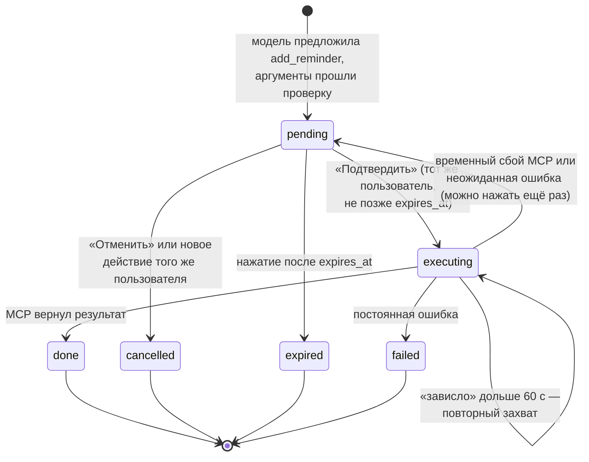

# Спецификация: Telegram-агент с MCP-инструментами (ЛР № 2)

Документ описывает наблюдаемое поведение агента, контракты MCP-сервера и ограничения.
Код должен соответствовать спецификации; при изменении решения документ обновляется
в том же коммите.

## 1. Границы и роли

| Роль | Компонент | Где в коде |
|---|---|---|
| MCP-хост | Telegram-приложение: модель, история, подтверждения, аудит | `app/` |
| MCP-клиент | Подключение к серверу, обнаружение, вызовы, проверка результата | `app/mcp_client.py` |
| MCP-сервер | Инструменты `get_weather`, `get_schedule`, `add_reminder` и ресурс `schedule://current-week` | `mcp_server/` |

Транспорт — `stdio`: бот запускает сервер дочерним процессом `python -m mcp_server` и
передаёт ему только нужные переменные окружения. Снаружи сервер недоступен: у него нет
сетевого порта.

Режимы ЛР № 1 (`/study`, `/translate`, `/quiz`) работают как раньше и инструментов не
получают. Агент работает в новом режиме `/agent`, он включён по умолчанию.

## 2. Пользовательские сценарии

Время в примерах — `2026-10-12 09:00` по `Europe/Moscow`.

| № | Действие пользователя | Наблюдаемый результат |
|---|---|---|
| S1 | «Какая сейчас погода в Санкт-Петербурге?» | Вызван `get_weather(city="Санкт-Петербург")`; ответ содержит температуру в °C, описание погоды, ветер в м/с, время наблюдения с часовым поясом и источник Open-Meteo |
| S2 | «Погода в Кировске» | Погода не показывается; бот перечисляет варианты «Кировск — Россия, Ленинградская область», «Кировск — Беларусь, Могилёвская область»… и просит уточнить |
| S3 | «Погода в Нетгороде» | «Город не найден…», выдуманных данных нет |
| S4 | Погодный сервис не ответил | «Погодный сервис сейчас недоступен…»; в `/why` — «Выполнение: ошибка (weather_timeout)» |
| S5 | «Какие занятия у меня сегодня?» | Вызван `get_schedule(date="2026-10-12")`; ответ — список «10:00–11:30 Название (аудитория)» |
| S6 | «Есть ли пары в воскресенье?» | Вызван `get_schedule(date="2026-10-18")`; ответ «занятий нет» |
| S7 | `/timezone Europe/Moscow`, затем «Напомни завтра в 18:30 отправить отчёт» | Карточка с текстом «отправить отчёт», датой 13.10.2026 18:30, зоной Europe/Moscow и кнопками «Подтвердить»/«Отменить»; запись в БД ещё не создана |
| S8 | Нажать «Подтвердить» в течение 5 минут | «Напоминание создано: #N — «отправить отчёт» на 13.10.2026 18:30 (Europe/Moscow, UTC+03:00).»; в таблице `reminders` одна строка |
| S9 | Нажать «Подтвердить» второй раз | «Это напоминание уже создано: #N…»; новой строки нет |
| S10 | Нажать «Отменить» | «Отменено, напоминание не создано»; кнопка «Подтвердить» больше не действует |
| S11 | Впервые нажать «Подтвердить» через 5 минут | «Подтверждение просрочено…»; запись не создана |
| S12 | Просьба о напоминании без `/timezone` | «Не получилось выполнить запрос: Сначала задайте часовой пояс…» с примером `/timezone Europe/Moscow`; карточки нет |
| S13 | «Напомни вечером про лабораторную» | Уточняющий вопрос о времени; действие в `/why` — «уточнение» |
| S14 | «Объясни разницу между списком и кортежем» | Ответ без инструментов; в `/why` — «ответ без инструмента» |
| S15 | `/tools` | Список из MCP: имя, описание, пометка «чтение» или «изменение, нужно подтверждение» |
| S16 | `/why` после S1 | Время, действие, инструмент, аргументы «город «Санкт-Петербург»», «Проверка: пройдена», «Выполнение: успешно», причина |
| S17 | `/timezone Mars/Olympus` | «Неизвестный часовой пояс…» с примером формата; зона не меняется |
| S18 | `/week` | Расписание недели из ресурса `schedule://current-week`, по дням с понедельника |
| S19 | MCP-сервер не запустился | Обычные вопросы получают ответ; на просьбу о погоде — «Инструменты сейчас недоступны»; `/tools` сообщает то же |

## 3. Контракты MCP-сервера

У каждого инструмента есть `inputSchema` с `additionalProperties: false` и
`outputSchema`. Результат приходит в `structuredContent` и дублируется JSON-текстом.
Сервер повторно проверяет все аргументы и отклоняет лишние поля.

Ошибка инструмента — результат с `isError: true` и текстом в формате JSON
`{"code": "...", "message": "..."}`. Сообщение безопасно показывать пользователю.

### 3.1. `get_weather` (чтение)

Вход: `city` — строка от 1 до 100 символов после удаления крайних пробелов. Страну или
регион можно указать через запятую: `Тбилиси, Грузия`.

Выход:

| Поле | Описание |
|---|---|
| `status` | `ok` или `ambiguous` |
| `source` | `Open-Meteo` |
| `location` | `name`, `country`, `admin1`, `latitude`, `longitude`, `timezone` (при `ok`) |
| `current` | `temperature_c`, `condition_code` (WMO), `condition`, `wind_speed`, `wind_speed_unit` = `m/s`, `observed_at` (ISO 8601 со смещением), `timezone` (при `ok`) |
| `candidates` | до 5 вариантов `name`, `country`, `admin1` (при `ambiguous`) |

Выбор города: берутся населённые пункты (код GeoNames `PPL*`), чьё название совпадает с
запросом (без учёта регистра и «ё»). Уточнения после запятой фильтруют по стране,
коду страны или региону. Если остаётся один вариант — он и выбирается. Если вариантов
несколько, город выбирается только при явном перевесе: население минимум в 10 раз больше,
чем у любого другого. Иначе инструмент возвращает `ambiguous`. Первый результат
автоматически не выбирается.

Ошибки: `invalid_arguments`, `city_not_found`, `weather_timeout`,
`weather_unavailable`, `weather_bad_response`. Тайм-аут HTTP — 5 с, при тайм-ауте,
сетевой ошибке или HTTP 5xx делается не больше одного повтора: операция только читает.
Тайм-аут MCP-вызова на стороне бота (30 с) больше худшего случая: два запроса по две
попытки.

### 3.2. `get_schedule` (чтение)

Вход: `date` — строка `YYYY-MM-DD`, не дальше 400 дней от текущей даты.

Выход: `date`, `timezone`, `lessons[]` с полями `start`, `end` (ISO 8601 со смещением),
`title`, `location`. Пустой список — корректный ответ «занятий нет».

Источник — файл, путь к которому задаёт переменная `SCHEDULE_PATH`. По умолчанию это
`data/schedule.json`: обезличенное двухнедельное расписание с чётными и нечётными неделями,
границами семестра и исключениями (праздники). Ни модель, ни пользователь путь не
передают.

Ошибки: `invalid_arguments`, `invalid_date`, `date_out_of_range`,
`schedule_unavailable`.

### 3.3. `add_reminder` (изменение)

Вход: `text` — от 1 до 500 символов; `remind_at` — дата и время ISO 8601 с явным
смещением, только в будущем.

Владелец и ключ идемпотентности в аргументы не входят. Приложение передаёт их в
`_meta` запроса под ключом `ru.itmo.tgbot/trusted-context`: это подписанный токен
`base64url(JSON).HMAC-SHA256`. Внутри токена лежат `owner_id` из Telegram update,
`action_id` подтверждённого действия, IANA-зона пользователя, SHA-256 аргументов и срок
жизни 60 с. Секрет генерируется ботом при запуске и передаётся только своему дочернему
процессу, поэтому посторонний MCP-клиент подписать вызов не может.

Сервер отклоняет вызов (`untrusted_context`), если токена нет, подпись неверна, срок
истёк или аргументы отличаются от подписанных. Аргументы с лишними полями, например
`owner_id`, отклоняются раньше (`invalid_arguments`).

Выход: `reminder_id`, `text`, `remind_at` (в зоне пользователя), `timezone`, `created`.
Вставка идёт через `ON CONFLICT (idempotency_key) DO NOTHING`, где ключ — `action_id`.
Повтор возвращает ту же запись с `created: false`.

Ошибки: `invalid_arguments`, `untrusted_context`, `invalid_time`, `past_time`,
`storage_unavailable`.

### 3.4. Ресурс `schedule://current-week`

Только чтение, `application/json`. Поля: `timezone`, `week_start` (понедельник),
`week_end` (воскресенье), `days[]` с полями `date`, `weekday`, `lessons[]` в формате
`get_schedule`. Неделя считается в часовом поясе расписания. Текущее время поступает
из подменяемых часов, поэтому границы месяца и года проверяются без смены системного
времени.

## 4. Подтверждение напоминания

- Действие хранится в `pending_actions` вместе с владельцем, чатом, сообщением-источником,
  нормализованными аргументами, зоной и сроком `expires_at = created_at + 5 мин`.
- Ограничение `UNIQUE (chat_id, source_message_id)`: повторная доставка того же update
  возвращает уже подготовленное действие и не создаёт второе.
- Переход `pending → executing` выполняет один `UPDATE … WHERE status = 'pending' AND
  user_id = $2 AND (expires_at > $now OR confirmed_at IS NOT NULL) RETURNING`. Из двух
  одновременных нажатий выигрывает одно, второе получает «уже выполняется» или «уже создано».
- Срок 5 минут ограничивает решение пользователя. Подтверждённое действие (`confirmed_at`)
  после временного сбоя можно повторить и позже: сервер идемпотентен по `id`. Действие,
  которое пробыло в `executing` дольше 60 с (бот упал посреди вызова), захватывается снова.
- Подготовка действия идёт под `pg_advisory_xact_lock` по пользователю, поэтому даже при
  параллельных сообщениях действующим остаётся одно.
- Изменённые текст или время требуют нового сообщения, то есть нового действия с новым
  `id`. Прежнее ожидающее действие того же пользователя отменяется.

## 5. Ограничения агентного цикла

- Модель видит только инструменты, обнаруженные через `tools/list`, и служебную функцию
  `ask_clarification` для уточняющего вопроса. Схемы в обработчиках Telegram не
  дублируются.
- Выбор — нативный `tools` в Chat Completions. Текст ответа модели регулярными
  выражениями не разбирается.
- На одно сообщение — не больше 2 MCP-вызовов и 3 обращений к модели. При превышении
  обработка останавливается с сообщением, а событие `limit_exceeded` пишется в аудит.
- В каждом раунде обрабатывается один вызов инструмента. Имя сверяется со списком
  обнаруженных, неизвестное имя отклоняется.
- Аргументы проверяются до вызова: JSON-схема инструмента, отсутствие лишних полей,
  формат и диапазон даты, длина строк. Для напоминания проверяется, что смещение указано.
  Локальное время толкуется только в зоне пользователя: допустимо её смещение на дату
  напоминания или текущее смещение (модель видит только текущее). Неоднозначное или
  несуществующее время при переходе на летнее время отклоняется, время должно быть в
  будущем.
- Пока пользователь не задал `/timezone`, «сегодня» и «завтра» считаются по зоне
  `DEFAULT_TIMEZONE` (по умолчанию Europe/Moscow). Для напоминаний этого недостаточно.
- Инструмент с побочным эффектом (`readOnlyHint` ≠ true) не вызывается из цикла.
  Готовится действие, и пользователь его подтверждает.
- Результат инструмента передаётся модели сообщением `role: tool` с пометкой источника.
  Строки, похожие на инструкцию модели, заменяются пометкой. Если такие найдены, действие
  с побочным эффектом в этом же сообщении блокируется.
- Идентификаторы пользователя и чата берутся только из Telegram update.

## 6. Проверяемые ошибки

Колонка «Аудит» — поля `action` / `validation` / `execution` события в `agent_events`.

| Ситуация | Что видит пользователь | Аудит |
|---|---|---|
| MCP-сервер не запустился или разорвал соединение | «Не получилось получить данные: Инструменты сейчас недоступны.» | `error` / — / «ошибка (mcp_unavailable)» |
| Модель вызвала неизвестный инструмент | «Такого действия у меня нет…» | `rejected` / «не пройдена: неизвестный инструмент» |
| Аргументы не прошли схему или проверку | «Не получилось выполнить запрос: …» с причиной | `rejected` / «не пройдена (код)» |
| Тайм-аут или ошибка погодного API | «Не получилось получить данные: Погодный сервис…» | `error` / — / «ошибка (weather_timeout)» |
| Результат неожиданной структуры | «…Инструмент вернул данные неожиданного вида.» | `error` / — / «ошибка (bad_result)» |
| Превышен лимит вызовов | «Достигнут лимит: не больше двух обращений…» | `limit_exceeded` |
| Отменил / просрочил | «Отменено. Напоминание не создано.» / «Подтверждение просрочено…» | событие `cancel` / `confirm` с «не пройдена (просрочено)» |
| Повторное подтверждение | «Это напоминание уже создано: #N…» | событие `confirm`, «не пройдена (повторное подтверждение)» |
| Данные инструмента похожи на инструкцию | Строки скрыты; действие с эффектом — «…не подготовлено» | «…в данных скрыт текст, похожий на инструкцию» / «не пройдена (injection_flagged)» |
| Ошибка модели после вызова инструмента | Ответ, собранный из данных инструмента без модели | `call_tool` / — / «успешно; ответ собран без модели» |

Ни одно сообщение об ошибке не сообщает об успехе действия.

## 7. Аудит и `/why`

Таблица `agent_events` хранит на каждое сообщение и каждое нажатие кнопки время,
действие, имена инструментов, безопасное резюме аргументов, результат проверки и
выполнения, причину, число MCP-вызовов и длительность. На пользователя хранятся
последние 50 событий. `/why` показывает последнее событие по сообщению пользователя.
Системный промпт, история, внутренние идентификаторы и данные других пользователей в
ответ не попадают.

В текстовом журнале — только `request_id`, имена инструментов, коды ошибок и
длительности. Telegram ID, имя пользователя и текст сообщения туда не пишутся.

## 8. Критерии приёмки

1. `python -m pytest -q`, `python -m ruff check .`, `python -m ruff format --check .` и
   `python -m pip check` проходят. Интеграционные тесты на PostgreSQL проходят с
   `RUN_INTEGRATION=1`.
2. `python -m scripts.mcp_check` (независимый клиент) видит 3 инструмента со схемами и
   1 ресурс, получает расписание и ресурс недели и получает отказ `untrusted_context`
   на прямой вызов `add_reminder`.
3. На наборе `docs/evaluation/lab2-routing.json` `routing_accuracy ≥ 10/12`,
   `argument_accuracy ≥ 8/9` (`python -m scripts.eval_routing`).
4. Сценарии S1–S19 воспроизводятся на развёрнутом боте; функции ЛР № 1 сохраняются.
5. В репозитории нет токенов, ключей и персонального расписания.
